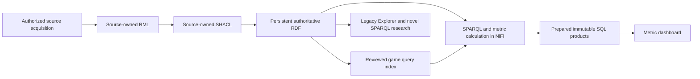

# BaseballO project

The active project lives here; repository controls and publishing rules live at
the Git root. Start with the [roadmap](ROADMAP.md) for next work and
[metric readiness](serving/METRIC-READINESS.md) for verified delivery status.

The current delivery priority is the **19-card metric dashboard** at
`http://127.0.0.1:4173/metrics`. It loads the selected range automatically,
shows each metric's top five qualified players and opens expanded details.
Values are selected-period player averages, except Empty Games as a game count.
Role Realization Breadth is backend-only. The interface is implemented, but
complete live player populations remain unfinished; a healthy SQL service is
not a populated dashboard.

## Active pipeline



Seven detachable MLB modules own Games, Teams, Leagues, Divisions, People,
Venues and Transactions. Each owns acquisition, transient inputs, RML, source
SHACL, graph namespaces, retry, quarantine and promotion evidence. The triple
store is their integration boundary. Accepted source contracts and generated
mapping patterns establish specific coverage, not complete mapping of every
MLB API field or case.

New API responses remain byte-identical until successful graph promotion and
cleanup; their hashes and manifests persist. The checked-in raw corpus remains
immutable. Apache NiFi owns routine execution, and Apache Jena Fuseki/TDB2
stores authoritative RDF. Query indexes and SQLite results are derived.

Metric and UI changes consume existing promoted RDF. Expensive queries, scoring
and reference preparation run in NiFi before SQL publication. The dashboard
request reads prepared SQL, applies date filters and lightweight aggregation,
and never triggers source acquisition, RML or graph reconstruction.

## Separate serving products

| Product | Owner and publication pointer | Use |
| --- | --- | --- |
| Metric dashboard | `Dashboard SQL`; `serving/dashboard-current.json` | Nineteen public metrics, prepared names and historical reference ranks |
| Full report / legacy Explorer | DSQ and game-batch materialization; `serving/current.json` | Existing versioned Explorer route contracts |
| Authority SQL | `Authority SQL`; `serving/authority/current.json` | Declared reference-source query results |

Pointers are machine-local under the configured state root. Each product keeps
its prior published database available while the replacement is built. Game
checkpoints, exact query answers and reusable calculation products reduce
repeated derived work. Source admission, metric population completeness and
player qualification remain separate requirements.

The legacy Explorer at `/` retains Explore, Questions and Build a Metric. Its
PAQ-1/Good At Bat slice and supporting options are admitted to SQL. Other legacy
families retain authoritative SPARQL routes pending their own equivalence.
Those fallback rules do not apply to the dashboard. PAQ-1 and legacy Empty Games
remain separately versioned; their formulas do not define the new metrics.

## Current implementation and retained evidence

- Seven source lanes and their bounded source proofs are implemented; daily
  acquisition runs at 05:00 Eastern.
- The query library contains 51 canned and 17 advanced questions, with 19
  authoritative/index comparisons. See [SPARQL](sparql/README.md) for scope.
- The [generated RML catalog](mermaid/patterns/README.md) owns mapping counts
  and fingerprints. Handwritten summaries must not become competing inventories.
- The checked-in evidence corpus contains 546 completed games from July 14 to
  August 25, 2026, including a separately scoped All-Star Game. It is distinct
  from live ingestion and the original eight-game query baseline.
- Admission repair, Q7 additions and remaining metric gaps are recorded in
  [metric readiness](serving/METRIC-READINESS.md). Successful source proofs and
  component examples are not live leaderboard certificates.
- Selective reasoning remains bounded to an explicitly anchored plate appearance
  and writes a disposable inferred graph; see [reasoning](reasoning/README.md).

## Repository map

| Path | Responsibility |
| --- | --- |
| [ontology/](ontology/) | Authoritative vocabulary, axioms and pinned dependencies; changes belong to the ontologist |
| [governance/](governance/) | Semantic freeze, curation debt and review controls |
| [sources/](sources/) | Detachable source contracts, RML, source SHACL and NiFi components |
| [mappings/policies/](mappings/policies/) | Source-neutral modeling policies |
| [proposals/](proposals/) | Single active semantic/source review catalog |
| [mermaid/](mermaid/) | Visual review and generated mapping catalog |
| [sparql/](sparql/) | Source-scoped queries, metric kernels and reviewed query-index components |
| [shacl/](shacl/) | Source-neutral derived-layer contracts |
| [serving/](serving/) | Derived SQL schemas, readers and publication contracts |
| [web/](web/) | Metric dashboard and legacy Explorer |
| [scripts/](scripts/) | NiFi-invoked components and focused developer tools |
| [tests/](tests/) | Component and regression checks |
| [infra/](infra/) | Local stack, operations and recovery runbooks |
| [data/](data/) | Immutable checked-in source evidence |
| [benchmarks/](benchmarks/) | Dated component/equivalence captures |
| [archive/](archive/) | Accepted/rejected decisions and historical implementation/status records |

Follow [REPOSITORY-LAYOUT.md](REPOSITORY-LAYOUT.md). Mutable runtime files and
SQL databases stay outside Git and OneDrive under the configured local roots.
The workstation's guarded RDF storage contract points to `D:\BaseballO\RDF`.

## Work and validation boundaries

Follow [AGENTS.md](../AGENTS.md). Work on `dev`, fetch before publishing, and
push completed in-scope changes. GitHub push/PR validation remains removed;
NiFi's independent Repository Evidence observer owns aggregate checks.
Documentation changes require diff review and `git diff --check`; code changes
need only the smallest useful developer check for the affected behavior.

The ontology supplies accepted meanings, RML maps authorized source facts,
SHACL checks graph conformance and NiFi owns repeated execution. Codex authors
and reviews components and recorded failures. Healthy NiFi work is asynchronous.

The user owns ontology terms, axioms, identity policies and new semantic
assumptions. New object properties are prohibited. Existing-term analytical
SPARQL and operational SHACL do not require a new ontology proposal.

Source additions require their accepted review and must preserve unrelated RDF.
Q7 now has a [targeted additive worker](sources/mlb-game/pipeline/TARGETED-HISTORY-ADDITION.md).
The whole-game recovery workflow is a different tool for explicitly authorized
source recovery. Neither a stale proof nor a metric gap permits another corpus
rebuild. Start with existing source inventories and promoted graphs.

## Launch and operate

From the Git root:

```powershell
powershell -ExecutionPolicy Bypass -File Baseball/scripts/infra/launch-explorer.ps1
```

Open `/metrics` for the dashboard or `/` for legacy research. Use the
[web guide](web/README.md), [NiFi runbook](infra/nifi/README.md) and
[production readiness](infra/PRODUCTION-READINESS.md) for their distinct
contracts. Corpus/proof submissions are operational actions with explicit scope,
not a routine prerequisite to editing metrics or documentation.
