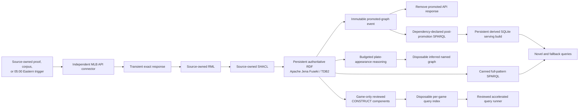

# BaseballO Knowledge Graph

BaseballO transforms MLB API responses into ontology-aligned RDF through seven
detachable source modules: Games, Teams, Leagues, Divisions, People, Venues,
and Transactions. Each module owns its connector, transient staging, RML,
source SHACL, graph namespace, retry, quarantine, promotion, and provenance.
RML runs against a disposable execution context; source bytes are never
rewritten. Successful API payloads are removed after the owning source's
promotion and cleanup gates, while compact hashes and run evidence persist.

The seven current source contracts are operationally active and semantically
approved. Their executable semantic surfaces are pinned against unreviewed
extension. Historical MLB-game findings remain in
[`sources/mlb-game/SEMANTIC-AUDIT.md`](sources/mlb-game/SEMANTIC-AUDIT.md) as
curation evidence; they are not current blockers. New fields or source
families still follow the proposal, Mermaid review, ontology decision, RML,
SHACL, and bounded-proof sequence.

## Active pipeline



The first proof-of-concept query is **Empty Games**: games in which a player
participated offensively without a qualifying offensive contribution. The
Explorer can examine those results as player ratios, batting-team rates,
consecutive stretches, games against pitchers faced, or individual
player-games. It can also produce a provisional damage ranking from the
currently reconstructed runner-on-base and out state at each failed plate
appearance, with double plays identified separately and the existing grind
evidence used to discount longer failures. The game-context reconstruction is
under review and must not be described as exact until its starting-state query
passes the regression plan. These results are derived from completeness-gated SPARQL evidence,
are not asserted as authoritative RDF, and remain a reviewed prototype rather
than a final published statistic. Reusable analytical grains are materialized
as SQL candidates, but the Empty Games UI route remains authoritative SPARQL
until exact end-to-end equivalence is accepted.

The checked-in raw corpus contains 546 distinct completed games with official
dates from 2026-07-14 through 2026-08-25. The accepted query baseline remains
the original eight-game 2026-08-03 subset: 246,191 authoritative triples and
52,992 disposable query-index triples. The preserved corpus audit covers the
48 canned queries that existed when it was captured and all 17 advanced
queries; the three later canned queries remain separately validated and are
included in the current 51-query inventory.
`plate-appearance-fingerprint` and PAQ-1.0 use authoritative MLB outcome,
bounded grind, and situational evidence. The rating is derived downstream and
is not asserted during ingestion. PAQ-1.0 remains reproducible, but its
game-context input and replacement formula are under review in
[`web/OFFENSIVE-ANALYTICS-REDESIGN.md`](web/OFFENSIVE-ANALYTICS-REDESIGN.md).

NiFi owns seven separate acquisition-through-promotion lanes. The Game lane
also owns query-index promotion and batch-aware serving materialization; the
six reference/event lanes promote only their source-owned authoritative RDF.
Each run emits local evidence and quarantines failures without stopping an
unrelated lane. The bundled direct game importer remains only a developer
fallback and parity reference. A separate daily `Repository Evidence` process
group owns aggregate validation without controlling any source lane.
Nineteen authoritative/indexed query pairs have exact corpus results; the
reviewed runner selects 16 indexed routes and keeps three reviewed routes on the
authoritative graph. Those routes govern batch query selection, not direct
browser access. Contract 5 can populate reusable SQL grains, while canonical
SPARQL remains the semantic definition and fallback path. The interface shows
the selected layer and immutable serving-build fingerprint explicitly.

Plate Appearance Quality/Good At Bat is the first admitted Explorer vertical
slice on the persistent analytical serving layer. Contract 5 materializes
candidate shared grains for Simple Explore, all 17 reviewed Advanced DSQs, all
39 non-option canned DSQs, Empty Games, Derived, and routine option lists. Each
static DSQ owns a named graph-partitioned SQLite table, while the 12 option
lookups reuse shared facts rather than duplicating results. Those additional UI
families remain on authoritative SPARQL until each passes
reviewed end-to-end equivalence. After a daily acquisition's affected
authoritative and indexed graphs are all promoted, NiFi runs bounded per-game
SPARQL, writes immutable graph-scoped result grains, checks retained RDF-result
bindings and database integrity, records timing evidence, and atomically
replaces `serving/current.json`. The UI reads that build only for admitted
routes and shows the exact SQL coverage, build, and corpus fingerprints.
Users can inspect individual plate appearances or a player-level average PAQ
with band counts; both are derived from the same materialized plate-appearance
facts and remain sortable in the UI. A missing, stale, or invalid build falls
back to the matching authoritative SPARQL. Novel research questions remain live
SPARQL until they are approved, historically backfilled, and added to NiFi's
normal materialization lifecycle.
Reference authority graphs now feed a separate immutable SQLite serving build
through promoted-graph events. Corrections replace one complete source-graph
partition, while the prior authority pointer remains live on failure. A manual
`Serving Equivalence` group records exact authoritative-versus-candidate-SQL
evidence before any additional UI family is admitted.
The hash-pinned [`sparql/query-modules/`](sparql/query-modules/) package now
provides the first reusable path for that admission. Its index catalog lets a
declarative DSQ select one accepted event fact grain, reviewed dimensions,
distinct measures, and an additive SQL merge contract. A separate authority
catalog provides composable Person, Organization, Venue, Day, name, identifier,
measurement, handedness, position, coordinate, capacity, and playing-surface
patterns over independently promoted source graphs. The compiler produces
bounded SPARQL without requiring each question author to retrace RML and SHACL,
while preserving the full world-side/ICE structure. Fact-to-fact bridges remain
blocked until they receive explicit equivalence tests.
SQLite is derived and never a second source of truth. Its analytical facts are
rebuildable from persistent RDF. The current regular-season/All-Star partition
also depends on compact acquisition provenance and checked historical schedule
evidence until an approved game-type fact is mapped into authoritative RDF;
the serving contract records that gap explicitly. See
[`serving/`](serving/) for the contract and runbook.

The Explorer now separates three jobs at the top level: **Explore** for simple
subject-first tables including PAQ, **Questions** for reviewed DSQs such as
Empty Games and every advanced query in one flat selector, and **Build a Metric** for compatible
numerator/denominator calculations. Detailed PAQ evidence remains available in
the result and CSV without crowding the default table.
The authoritative and query-index layers have executable SHACL profiles, and
disposable reasoning output has a separate closure-safe
provenance profile. All fixture and audit-corpus graphs conform with zero
results before reasoning is applied in the checked-in validation evidence;
this is not a claim about an uninspected live run. Selective reasoning is
available for one explicitly anchored plate appearance through separate event
order, event structure, and participation profiles. Each profile has hard
computational budgets and emits a pinned BFO CLIF proof package alongside a
disposable inferred graph. The current fixture baseline proves all 107
translated obligations with a pinned Z3 backend.

Pitching analytics expose a complete final-call partition—balls, called
strikes, swinging/missed strikes, fouls/foul tips, balls put in play, and hit
batters—so the displayed components reconcile to total pitches. Replay review
graphs preserve the on-field judgment, optional challenge, replay act, original and
operative decision ICEs, affirming or overturning result, and final structured
outcome as distinct entities. The mapper no longer synthesizes an opposite
original decision for overturned ball/strike or out/safe reviews. Earlier and
operative Decision ICEs remain distinct historical outputs; an override
changes institutional effect without erasing the earlier evidence.

## Repository map

| Path | Purpose | Status |
| --- | --- | --- |
| [`ontology/`](ontology/) | BaseballO taxonomic backbone, optional axiom overlay, and dependency snapshots | Frozen pending curation review |
| [`governance/`](governance/) | Semantic freeze, exact curation debt, review schema, and recent-work audit | Active control |
| [`sources/mlb-game/`](sources/mlb-game/) | Detachable MLB game source contract, RML, SHACL, query index, and audit | Active; approved designs only |
| [`sources/mlb-teams/`](sources/mlb-teams/), [`sources/mlb-leagues/`](sources/mlb-leagues/), [`sources/mlb-divisions/`](sources/mlb-divisions/) | Independent organization authority modules | Active; approved designs only |
| [`sources/mlb-people/`](sources/mlb-people/), [`sources/mlb-venues/`](sources/mlb-venues/) | Independent persistent-entity authority modules | Active; approved designs only |
| [`sources/mlb-transactions/`](sources/mlb-transactions/) | Independent transaction event-evidence module | Active; approved designs only |
| [`mappings/policies/`](mappings/policies/) | Source-neutral realist modeling policies | Active |
| [`sources/`](sources/) | Machine-readable source-module registry and separation contract | Active |
| [`mermaid/`](mermaid/) | Visual review of the RML source, map, join, and identity shapes | Active review |
| [`shacl/`](shacl/) | Source-neutral query-index and reasoning-output constraints | Active derived-layer contract |
| [`proposals/`](proposals/) | Single review-only catalog for unresolved source and ontology designs | Active review |
| [`reasoning/`](reasoning/) | Budgeted profiles, pinned BFO CLIF source contract, and reasoning runbook | Active selective experiment |
| [`data/`](data/) | Untouched development fixture, 546-game raw corpus, and bounded eight-game audit subset | Active immutable inputs |
| [`archive/`](archive/) | Accepted, rejected, and superseded design records plus retired implementation history | Historical |
| [`sparql/`](sparql/) | Canned and advanced semantic queries, reusable DSQ modules, and reviewable components for the disposable query-index graph | Active query library and acceleration contract |
| [`serving/`](serving/) | Versioned derived SQLite schema, promotion contract, rebuild and rollback runbook | Routine Explorer serving active |
| [`web/`](web/) | Playable local analytics explorer and allowlisted query compiler | Local MVP active |
| [`scripts/`](scripts/) | NiFi-invoked pipeline components, infrastructure automation, and focused developer fallbacks | Active |
| [`tests/`](tests/) | Offline component, contract, integration, and regression tests | Active |
| [`infra/`](infra/) | Pinned local NiFi and Fuseki development stack | Active |

The ownership rules and the distinction between the Git root and this project
root are defined in [`REPOSITORY-LAYOUT.md`](REPOSITORY-LAYOUT.md).

## Validation ownership

The replacement NiFi flow owns the seven source runtime lifecycles. A separate
daily `Repository Evidence` group owns aggregate validation as an asynchronous
observer; its failure never controls a source lane or changes RDF or serving
pointers. Developers run only focused checks for the component being changed
and do not recreate the aggregate workflow as an attended command chain.

SPARQL and SHACL over accepted ontology terms are ordinary maintained project
artifacts. Ontologist approval is required for new ontology terms, axioms,
identity policies, object properties, or genuinely new modeling assumptions,
not for every query or conformance-shape revision.

To run only the mapping-specific validation, use the following command:

```powershell
python Baseball/sources/mlb-game/mapping/validate_mlb_game_mapping.py `
  Baseball/data/raw/game-566279.json
```

The validator checks the mapping's Turtle structure, locally declared BaseballO classes, the completed-game precondition, source identifiers, observed result coverage, sample-specific IRI collision risks, and all SHACL profiles. Successful RML output is also checked against the authoritative profile before loading.

## Modeling guardrails

- Treat the MLB JSON as authoritative and leave it unchanged.
- Begin with the source-independent world structure. Records, data elements,
  measurement ICEs, classifications, and estimates are information about that
  structure; they must not replace or conceal it.
- Do not create a class per source field or encode a missing quality, relation,
  geometry, or process profile inside an ICE class name or definition.
- Keep every external source in a detachable module with its own RML, SHACL,
  and NiFi lane. Join sources only in the triple store through
  dependency-declared SPARQL.
- Model people, roles, acts, processes, temporal regions, sites, and information content entities—not stored statistics.
- Reuse canonical `allPlays`; do not remap duplicate API views as new events.
- Compare every proposed source field with existing authoritative and derived
  coverage before modeling it. Exclude duplicates, derivable values, and
  identity-only join fields from domain RDF unless an explicit reviewed source
  assertion requires preservation.
- Build deterministic IRIs from source identifiers.
- Use temporal precedence unless genuine causation is supported.
- Record ontology gaps explicitly. Do not add classes, properties, or shortcuts
  to the ontology without approval; operational query-index terms must remain
  isolated from the authoritative graph.

The normative authoring and acceptance sequence is documented in the
[ontology authoring rules](ontology/AUTHORING-RULES.md). For every new source
family, review-only source-independent Mermaid shapes come before executable
RML. Ontologist acceptance comes before ontology, SHACL, SPARQL, serving, or UI
integration. One-record and one-game proofs come before any corpus load.

## RML visual review

Start with the [Mermaid review index](mermaid/README.md). New source families
begin in the review-only proposal catalog, where diagrams show the intended
world-side referents and information artifacts before RML exists. After
approval and implementation, generated diagrams prove that the active RML
still matches the accepted shapes.

## Operate the ingestion lanes

After bootstrapping and starting the local stack, use the
[NiFi runbook](infra/nifi/README.md) for the source inventory, provisioning,
proof gates, schedules, corpus submission, evidence, and recovery boundaries.
The authorized source-owned triggers run daily at 05:00 Eastern and do not
require continuous monitoring. Proof and corpus requests are explicit one-shot
submissions; the submit-only corpus command is:

```powershell
.\Baseball\scripts\infra\submit-nifi-corpus.ps1 -Module all
```

The checked-in evidence corpus is not reacquired merely to rerun a developer
workflow. A direct file import remains documented in the
[pipeline component runbook](scripts/pipeline/README.md), but it is not an
active NiFi inbox or the normal ingestion path.

## Run selective reasoning

Follow the [selective reasoning runbook](reasoning/README.md) to cache the
checksum-pinned BFO CLIF modules and reason over one plate appearance. There is
deliberately no full-game or corpus mode. Loading an inferred graph is explicit
and never changes the authoritative or query-index graphs.

## Next phase

Use [`ROADMAP.md`](ROADMAP.md) as the single current continuation plan. All
seven accepted MLB lanes passed their bounded source-owned proofs. Live corpus,
quarantine, cleanup, and serving-build completion must be established from
NiFi's terminal evidence and machine-local pointers, not from an attended Codex
session or a timestamped README claim. The next operational work is
family-by-family Explorer equivalence and SQL admission. The next semantic
decisions are indexed in [`proposals/`](proposals/): remaining MLB fields,
temporal Role histories, and the clean Statcast restart. Statcast receives no
RML until those Mermaids are explicitly accepted. Weather and travel/rest
remain later detachable sources.
