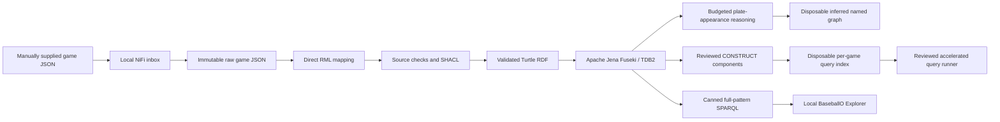

# BaseballO Knowledge Graph

BaseballO transforms untouched completed-game JSON into ontology-aligned RDF. The active implementation accepts a file supplied through a local manual inbox and maps the raw JSON directly with RML; it does not flatten, normalize, enrich, or store derived statistics.

## Active pipeline



The first proof-of-concept query is **Empty Games**: games in which a player participated offensively without a qualifying offensive contribution. That result must be derived with SPARQL, never stored during ingestion.

Current checked-in evidence covers eight completed games from 2026-08-03:
228,576 authoritative triples and 52,944 disposable query-index triples. All
48 canned queries and 16 advanced queries have reproducible result baselines.
Eighteen authoritative/indexed query pairs have exact corpus results; the
reviewed runner selects 15 indexed routes and keeps three neutral routes on the
authoritative graph. The Explorer remains authoritative-only until its
interaction with the operational router is reviewed separately.
Both graph layers have executable SHACL profiles. All fixture and corpus graphs
conform with zero results before reasoning is applied. Selective reasoning is
available for one explicitly anchored plate appearance through separate event
order, event structure, and participation profiles. Each profile has hard
computational budgets and emits a pinned BFO CLIF proof package alongside a
disposable inferred graph. The current fixture baseline proves all 107
translated obligations with a pinned Z3 backend.

## Repository map

| Path | Purpose | Status |
| --- | --- | --- |
| [`ontology/`](ontology/) | BaseballO taxonomic backbone, optional axiom overlay, and dependency snapshots | Active |
| [`mappings/direct/`](mappings/direct/) | Direct raw-JSON-to-RDF RML and validator | Active |
| [`mappings/policies/`](mappings/policies/) | Approved modeling and IRI policies | Active |
| [`source-schema/`](source-schema/) | Observed schema and JSONPath inventory for the sample feed | Active reference |
| [`mermaid/`](mermaid/) | Visual review of the RML source, map, join, and identity shapes | Active review |
| [`shacl/`](shacl/) | Executable authoritative and query-index graph constraints | Active validation contract |
| [`reasoning/`](reasoning/) | Budgeted profiles, pinned BFO CLIF source contract, and reasoning runbook | Active selective experiment |
| [`data/`](data/) | Untouched development fixture and eight-game audit corpus | Active immutable inputs |
| [`archive/`](archive/) | Superseded preprocessing prototype and prior ontology snapshot | Historical |
| [`sparql/`](sparql/) | Canned and advanced semantic queries plus reviewable components for the disposable query-index graph | Active query library and acceleration contract |
| [`web/`](web/) | Playable local analytics explorer and allowlisted query compiler | Local MVP active |
| [`scripts/`](scripts/) | Manual import, RML execution, validation, indexing, and infrastructure automation | Active |
| [`tests/`](tests/) | Offline integration and future regression tests | Active |
| [`infra/`](infra/) | Pinned local NiFi and Fuseki development stack | Active |

## Validate the active mapping

Install the validation dependency and check the entire repository:

```powershell
python -m pip install -r Baseball/requirements-dev.txt
python Baseball/scripts/validate_repository.py
```

The same command runs automatically through [GitHub Actions](.github/workflows/validate.yml) on pushes and pull requests.

To run only the mapping-specific validation, use the following command:

```powershell
python Baseball/mappings/direct/validate_direct_mapping.py `
  Baseball/data/raw/game-566279.json
```

The validator checks the mapping's Turtle structure, locally declared BaseballO classes, the completed-game precondition, source identifiers, observed result coverage, sample-specific IRI collision risks, and both SHACL profiles. Successful RML output is also checked against the authoritative profile before loading.

## Modeling guardrails

- Treat the MLB JSON as authoritative and leave it unchanged.
- Model people, roles, acts, processes, temporal regions, sites, and information content entities—not stored statistics.
- Reuse canonical `allPlays`; do not remap duplicate API views as new events.
- Build deterministic IRIs from source identifiers.
- Use temporal precedence unless genuine causation is supported.
- Record ontology gaps explicitly. Do not add classes, properties, or shortcuts
  to the ontology without approval; operational query-index terms must remain
  isolated from the authoritative graph.

## RML visual review

Start with the [Mermaid review index](mermaid/README.md). It separates the intended pipeline from the implemented RML shape and highlights places requiring processor tests or modeling decisions.

## Execute the local vertical slice

After bootstrapping and starting the free local stack, follow the [manual game import runbook](scripts/pipeline/README.md). It archives untouched completed-game JSON, executes the pinned RMLMapper, validates source-to-RDF record counts, and loads complete named graphs into Fuseki with idempotent `PUT` requests.

Automated external acquisition is parked pending an approved data-access
source. The active NiFi flow makes no MLB or other external HTTP request. The
current corpus is already checked in and must not be reacquired merely to rerun
the local workflow.

## Run selective reasoning

Follow the [selective reasoning runbook](reasoning/README.md) to cache the
checksum-pinned BFO CLIF modules and reason over one plate appearance. There is
deliberately no full-game or corpus mode. Loading an inferred graph is explicit
and never changes the authoritative or query-index graphs.

## Next phase

Use [`NEXT-PHASE.md`](NEXT-PHASE.md) as the single current continuation plan.
It advances the reasoning experiment from its first bounded profiles, preserves
the separate ontology-review queue, and records only the current continuation
boundary.
