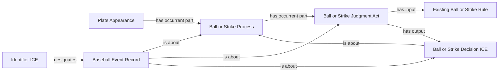

# Implementation boundary for accepted automatic count awards

The ontologist accepted question 5 of the September 15 metric completion
decisions: existing Ball/Strike Processes and their judgment pattern include
evidenced non-pitch count awards; an automatic second strike establishes two
strikes but contributes zero pitches to Recovery Quality. Exact answer:
`YEs. Balls and strikes get called on clock violations"`.
See `../metric-completion-decisions-2026-09-15/user-decision.md` and its
published decision `b4d4f88`. This records that named acceptance for engineering
and scoped runtime pins; it does not request or infer another semantic choice.

## Competency questions and accepted consequences

* Can a clock award be a Ball/Strike Process with no Pitch Act? Yes, under
  question 5's accepted use of the existing pitch-related history pattern.
* Is its judgment, decision or record the same entity as the counted process?
  No. Reuse the existing distinct-identity policy and game/playId scoping.
* Does an automatic second strike count as a delivered pitch? No. It changes
  the operative count and contributes zero recovery pitches.
* Do four provider rows for an intentional walk establish four umpire acts?
  No such identity decision was accepted. Withhold that extension.

No ontology class, object property, count-state individual, particular umpire
identity, exact judgment timestamp, or violation-act identity is introduced.
The existing judgment class expresses adjudication; the source does not identify
which official personally imposed the timer penalty, so no named agent or
role realization is fabricated. This is separate from evidence that an umpire
judgment occurred. Decisions remain about their counted processes.

## Existing source evidence and field selection

| Field or record | Selection | Use and missing-value behavior |
| --- | --- | --- |
| `gamePk`, PA `about.atBatIndex`, event `playId` | Identity/join-only | Existing game/event scoping, collision checked across all event IDs; no identity from descriptions. |
| `isPitch`, `type` | Already supplied; mapping coverage debt | Require explicit false and `no_pitch`. Missing or contradictory flags withhold. |
| `details.call.code`, `details.violation.type` | Already supplied; mapping coverage debt | First bounded implementation: VP + pitcher_pitch_timer, AC + batter_pitch_timer. Other awards are inventoried and withheld. |
| `details.isBall`, `isStrike`, `isInPlay`, `hasReview` | Already supplied | Require explicit agreeing ball/strike flags, no contact, no unresolved review. |
| `count.balls`, `count.strikes`, prior unfiltered event count | Already supplied / derived increment | Require exactly one matching increment, preserved other count and no reset after termination. No raw counter literal is a substitute for the counted process. |
| PA completion/review and complete indexed event membership | Already supplied | Reconcile against the final unfiltered source; corrections, gaps or duplicates withhold affected selection. |
| event `startTime`, `endTime` | Already supplied | Conservative ordering evidence only. Never assign a five-second provider window as the judgment's exact duration. |
| event descriptions | Already supplied | Record text only; no new semantic assertion inferred from wording. |
| home-plate official assignment | Already supplied | Does not identify the particular timer-penalty adjudicator. No new agent assertion. |

Immutable fixtures: `data/raw/samples/2026-07-18/823116.json`, PA 76/event 3,
playId `c5576ea2-9665-4006-8875-3cba5fab0284`, is a VP award from 0-0 to 1-0.
`data/raw/samples/2026-07-18/824088.json`, PA 33/event 0, playId
`f213963d-0938-4a7c-84f1-df71eaaa1b6b`, is an AC award from 0-0 to 0-1.
`data/raw/samples/2026-07-16/823440.json`, PA 33, supplies the counterexample:
four VB intentional-walk rows whose multiplicity is not an umpire-act census.

## Existing source-independent pattern

The source-specific projection uses existing `process/{ball|strike}/{playId}`,
`judgment/{ball|strike}/{playId}`, and `decision/{ball|strike}/{playId}` IRIs.
The record uses `event-record/count-award/{playId}` and its existing identifier
pattern. These lexical paths separate records from their referents; no source
field becomes a new domain relation. The PA remains the containing process.
Supported neighboring Pitch Acts can precede/follow the counted award using
existing BFO precedence, only when complete source order and nonoverlapping
source-event boundaries establish that order. No fictitious pitch or motion
is created for the award.

The owning source SHACL must require matching process/judgment/decision types,
one PA and one judgment/output, record provenance, and absence of a fabricated
pitch for the award. Source-to-RDF serialization must retain the exact selected
membership. One-record proof and whole-game conformance precede NiFi refresh.
The global semantic freeze remains unratified; only this approved scope's
engineering artifacts and runtime pins may change.
