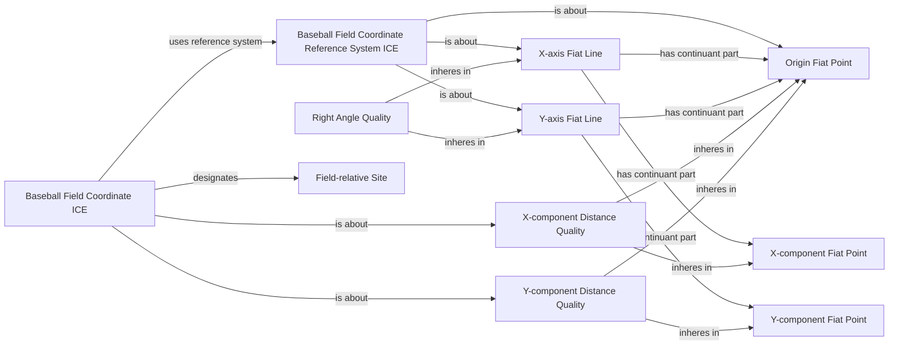

# Accepted source-independent coordinate pattern

```mermaid
flowchart LR
    FRAME[Baseball Field Coordinate Reference System ICE]
    ORIGIN[Origin Fiat Point]
    XLINE[X-axis Fiat Line]
    YLINE[Y-axis Fiat Line]
    ANGLE[Right Angle Quality]
    XPOINT[X-component Fiat Point]
    YPOINT[Y-component Fiat Point]
    XDIST[X-component Distance Quality]
    YDIST[Y-component Distance Quality]
    COORD[Baseball Field Coordinate ICE]
    SITE[Field-relative Site]

    FRAME -->|is about| ORIGIN
    FRAME -->|is about| XLINE
    FRAME -->|is about| YLINE
    XLINE -->|has continuant part| ORIGIN
    YLINE -->|has continuant part| ORIGIN
    XLINE -->|has continuant part| XPOINT
    YLINE -->|has continuant part| YPOINT
    ANGLE -->|inheres in| XLINE
    ANGLE -->|inheres in| YLINE
    XDIST -->|inheres in| ORIGIN
    XDIST -->|inheres in| XPOINT
    YDIST -->|inheres in| ORIGIN
    YDIST -->|inheres in| YPOINT
    COORD -->|uses reference system| FRAME
    COORD -->|is about| XDIST
    COORD -->|is about| YDIST
    COORD -->|designates| SITE
```

No node in this pattern is a Spatial Region or Coordinate System Axis.
