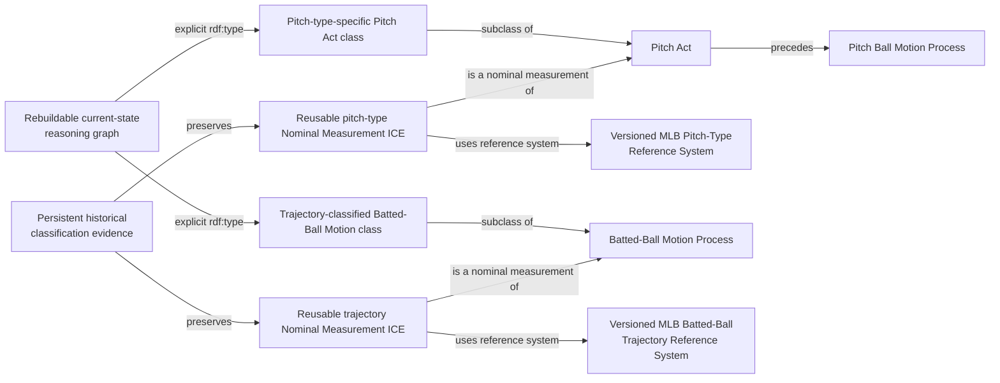
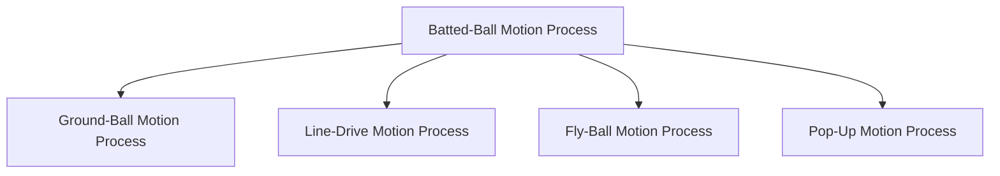

# Source-independent Mermaid

```mermaid
flowchart TB
    PITCH[Pitch Act]
    PITCH --> FF[Four-Seam Fastball Pitch Act]
    PITCH --> SI[Sinker Pitch Act]
    PITCH --> FC[Cutter Pitch Act]
    PITCH --> SL[Slider Pitch Act]
    PITCH --> ST[Sweeper Pitch Act]
    PITCH --> SV[Slurve Pitch Act]
    PITCH --> CU[Curveball Pitch Act]
    PITCH --> KC[Knuckle-Curve Pitch Act]
    PITCH --> CS[Slow Curve Pitch Act]
    PITCH --> CH[Changeup Pitch Act]
    PITCH --> FS[Splitter Pitch Act]
    PITCH --> FO[Forkball Pitch Act]
    PITCH --> SC[Screwball Pitch Act]
    PITCH --> KN[Knuckleball Pitch Act]
    PITCH --> EP[Eephus Pitch Act]
```

The subclass arrows describe the proposed ontology taxonomy. A promotion rule
selects the currently authoritative provider classification and explicitly
types the instance in the rebuildable current-state graph. Historical nominal
measurements remain in persistent evidence but cannot infer old class types.
Velocity and movement thresholds never determine these classes.
