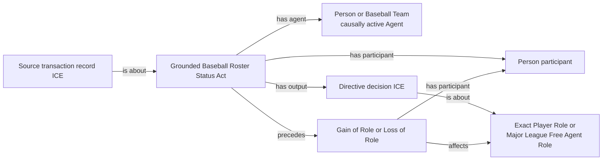
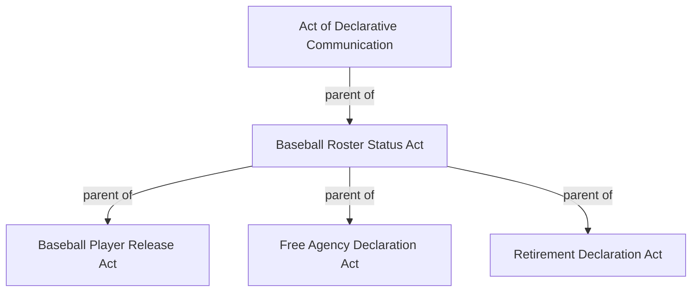

# Source-independent Mermaid

```mermaid
flowchart LR
    RECORD[Source transaction record ICE]
    ACT[Grounded Baseball Roster Status Act]
    AGENT[Person or Baseball Team\ncausally active Agent]
    PERSON[Person participant]
    DECISION[Directive decision ICE]
    TRANSITION[Gain of Role or Loss of Role]
    ROLE[Exact Player Role or\nMajor League Free Agent Role]

    RECORD -->|is about| ACT
    ACT -->|has agent| AGENT
    ACT -->|has participant| PERSON
    ACT -->|has output| DECISION
    DECISION -->|is about| ROLE
    ACT -->|precedes| TRANSITION
    TRANSITION -->|has participant| PERSON
    TRANSITION -->|affects| ROLE
```

```mermaid
flowchart TB
    DECL[Act of Declarative Communication]
    STATUS[Baseball Roster Status Act]
    RELEASE[Baseball Player Release Act]
    FREE[Free Agency Declaration Act]
    RETIRE[Retirement Declaration Act]

    DECL -->|parent of| STATUS
    STATUS -->|parent of| RELEASE
    STATUS -->|parent of| FREE
    STATUS -->|parent of| RETIRE
```

The second diagram shows proposed subclassing, not RDF object-property edges.
Other provider codes remain information-only in this pass.

