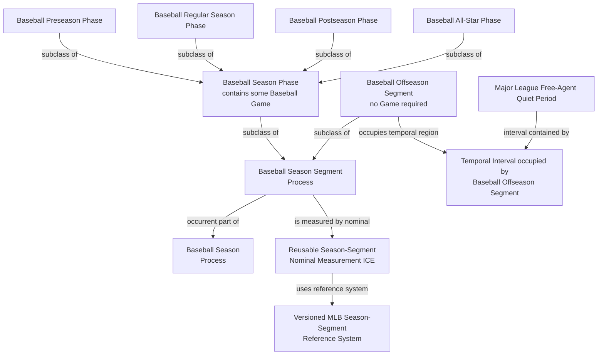
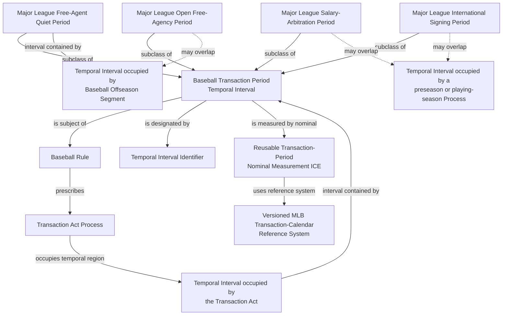

# Source-independent Mermaid

Dashed overlap edges are review explanations, not proposed object properties.
Executable temporal claims must use occupied Temporal Regions and accepted
interval relations.
