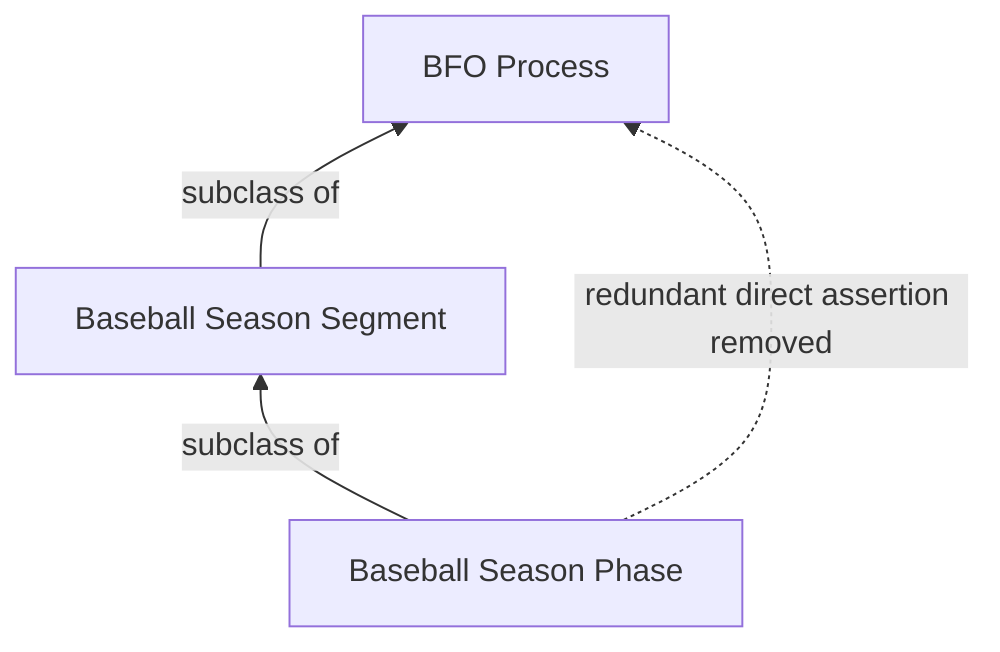

# Source-independent Mermaid

The solid chain is the accepted asserted hierarchy. The dotted edge is the
redundant direct assertion to remove.

After removal, a reasoner still entails that every Baseball Season Phase is a
BFO Process through Baseball Season Segment.
