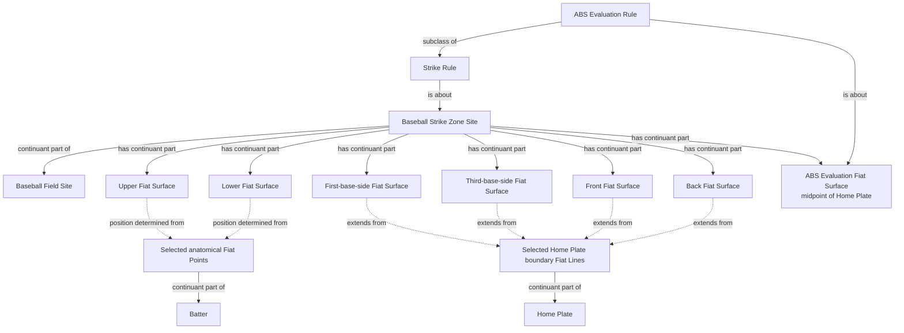

# Source-independent Mermaid

The dotted geometry edges expose the instance construction that measurements
must substantiate; they are not proposed object properties. The proposed OWL
axioms assert only necessary Site/Fiat-Surface/rule restrictions and leave
provider-specific anatomical and plate-line selection to reviewed RDF. No
Strike Zone Site equivalence axiom is proposed until those identity-bearing
anchors are modeled.
