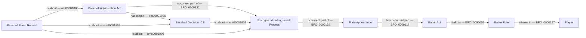
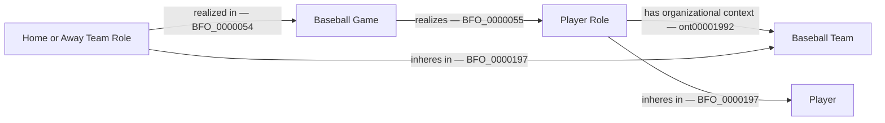

# Existing graph shapes for B1

Review only. Every solid edge is an accepted BFO/CCO relation. No new domain
predicate, class or identity is proposed. Analytical selection and counts are
not new RDF relations. The source-specific proof must preserve these paths.

The query may follow the existing inverse `occurrent part of` direction from
the Batter Act to its PA. No inference of official credit follows solely from
this diagram. B1's independent source and population conditions are essential.

Each game is checked separately. The query does not infer a person's missing
historical team membership from adjacent games or turn a stasis into a role
realization. Boxscore-roster equality and selected-game completeness remain
independent proof obligations.
