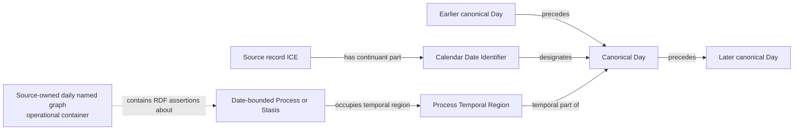

# Source-independent Mermaid

The dotted graph edge is operational notation, not an ontology property. Days
remain source-neutral. Each source lane owns its own daily graph product; the
triple store is the integration boundary.

