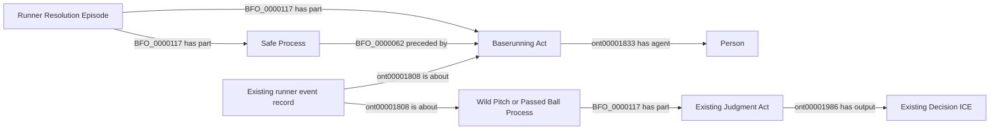

# EG3: first-base entry after an uncaught third strike

**Accepted October 9, 2026.** User reply: "Approve EG3 running entry".
The reviewed scope below is accepted, including generic future-game handling,
targeted additive repair through the existing NiFi owner, analytical integration
and the scoped semantic pin updates needed for implementation. No new ontology
classes or object properties, full rebuild, or unrelated RDF replacement.

The following is the proposal text accepted by that decision; its former
review-status and future-tense language are historical. Implementation status
belongs in the active roadmap and metric readiness record.

Status: **under review**, October 8, 2026. This is a metric decision over
existing RDF, not permission for a new mapping, class, relation or rebuild.

## Decision requested

For Empty Games, count a person's positively evidenced safe HOME-to-first
advance on an uncaught third strike with a separately recorded Wild Pitch or
Passed Ball as independent running progress. Give the batting channel no
positive credit. If that person otherwise has an official PA in the game,
this running contribution makes the game non-empty. Preserve the existing
complete-path and terminal-out rules; an intermediate safe step consumed by
an out in that same consequence cannot be kept as positive credit.

This settles only the binary Empty Games question. It introduces no numeric
weight for HOME-to-first and changes no weighted contribution or damage
formula. Existing independent running weights cover first-to-second onward.
It does not grant catcher-interference, error, fielder's-choice or unverified
first-base entry credit. The accepted catcher-interference exclusion remains.

## Evidence and existing boundary

The retained query inputs for game 823150, PA 67, identify Jake Burger's
separate running act, safe first-base resolution and Wild Pitch Process,
judgment and decision. Game 823911, PA 65, has a corresponding Passed Ball
entry for Rafael Flores Jr. Neither becomes a hit or positive batting event.
Their source excerpts are in [evidence.json](evidence.json); they are review
evidence, not ingestion inputs.

The reader currently refuses the independent channel at metric HOME because
the accepted running-weight table starts at first base. That is a remaining
metric boundary, not evidence that these runner processes are absent.

MLB's 2026 Rules 9.13(a)-(b) distinguish the strikeout from the accompanying
WP/PB when the batter reaches first. The rules establish the event distinction;
whether that supported running counts toward this custom metric is your
decision. [2026 Official Baseball Rules](https://mktg.mlbstatic.com/mlb/official-information/2026-official-baseball-rules.pdf).

## Existing graph pattern and competency questions

- Is this a positive independent-running contribution for the binary count?
  Proposed answer: yes, with the complete supported pattern and safe endpoint.
- Is it positive batting credit? No.
- Does a catcher-interference award receive this treatment? No.
- Does an unsupported or later-out path become known positive? No.
- Does a person without an official PA become eligible for Empty Games? No.

No field selection expands: every input is an existing graph fact or the
already accepted analytical metric-HOME convention. Implement after named
acceptance in the Empty Games reader only, with a focused positive/negative
regression. NiFi refreshes affected prepared results from retained RDF query
answers. Other metrics and authoritative graphs remain unchanged.
