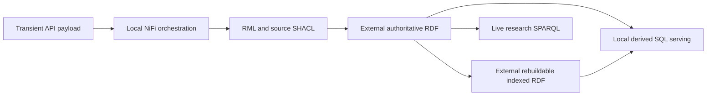

# External RDF storage boundary

```mermaid
flowchart LR
  API[Transient API payload] --> NIFI[Local NiFi orchestration]
  NIFI --> RML[RML and source SHACL]
  RML --> AUTH[External authoritative RDF]
  AUTH --> INDEX[External rebuildable indexed RDF]
  AUTH --> SQL[Local derived SQL serving]
  INDEX --> SQL
  AUTH --> RESEARCH[Live research SPARQL]
```

The diagram describes operational storage placement and dependency order. It does not introduce ontology relations.
