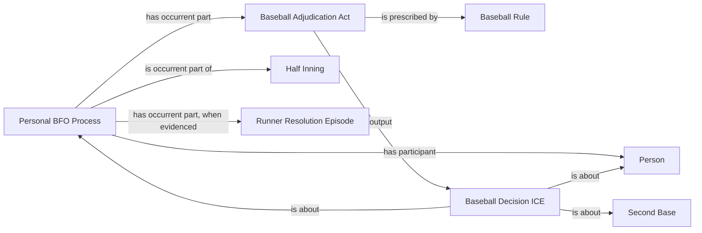
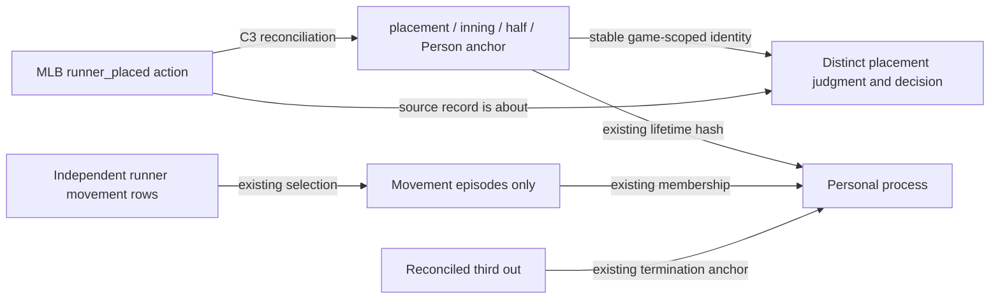

# Decision diagrams before executable mapping

These render the user's named placement decision using the existing C1 whole
and accepted adjudication pattern; they introduce no new class or relation.

