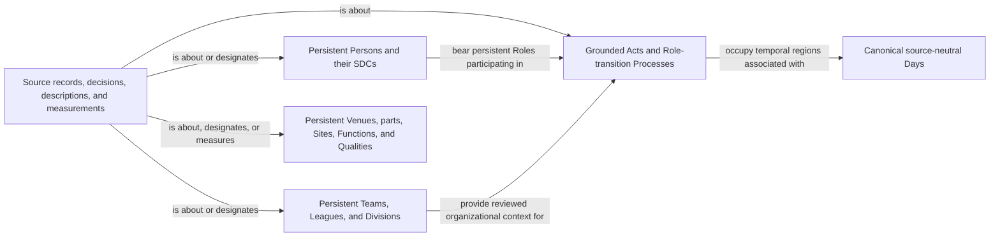

# Consolidated accepted Mermaid surface

The source-independent graph shape is the union of the nineteen exact Mermaid
artifacts linked from
[`../FINAL-MLB-RML-REVIEW.md`](../FINAL-MLB-RML-REVIEW.md). Each component
package pins its own Mermaid SHA-256 and remains the authoritative diagram for
that modeling boundary.

This overview does not replace or broaden any component diagram. It authorizes
only the ontology files named in `review.json`; executable RML remains blocked
until source-specific shapes are accepted.
