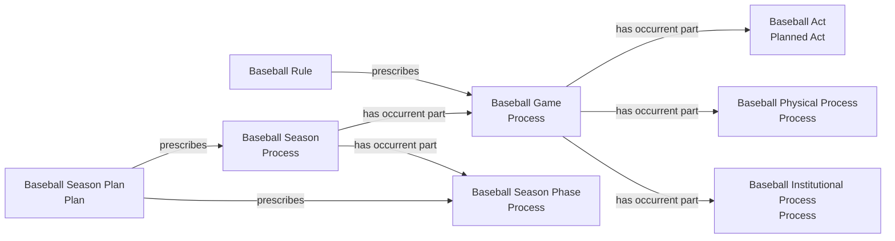
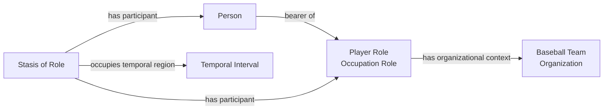

# Accepted source-independent shapes

## Game and season processes

The Game and Season are Processes even when a Rule or Plan prescribes them.
Their intentional Acts remain proper processual parts.

## Team context through an occupation role

This shape expresses the intended claim that a Person is a member of a Team in
virtue of a team-scoped Occupation Role. It does not introduce a second roster
membership role.
