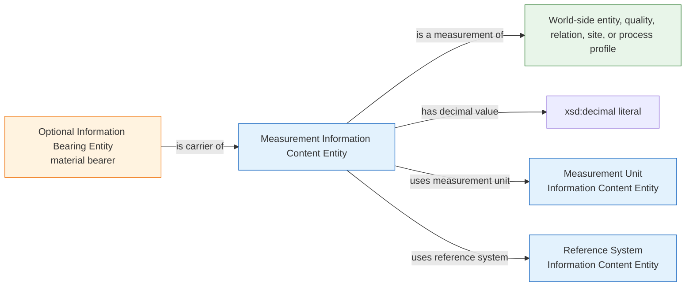
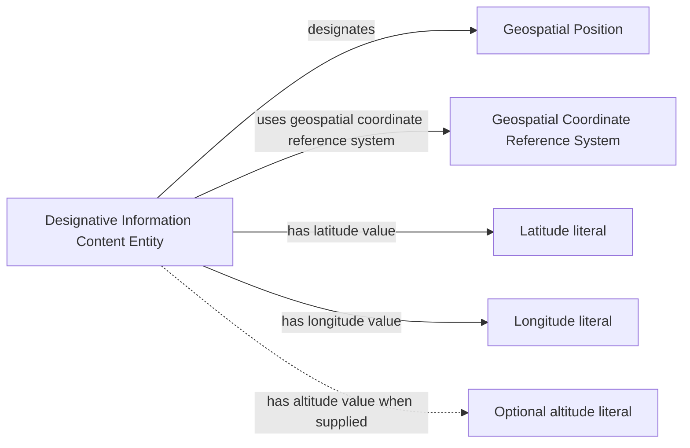
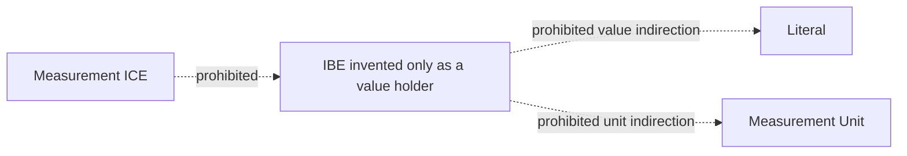

# Source-independent Mermaid

This diagram is independent of MLB JSON, Statcast CSV, RML, and storage
technology. It shows the proposed world/content/bearer separation.

The carrier edge is optional and semantically independent. A source record,
database row, file, or message may be an IBE that carries an ICE, but no such
material entity is asserted solely because the ICE has a literal value.

## Geographic specialization

This does not license field-relative baseball coordinates to masquerade as
geographic latitude/longitude. A Baseball Field Coordinate Reference System
must state its own standards and the coordinate ICE must be about a real site
or spatial entity.

## Prohibited collapse

