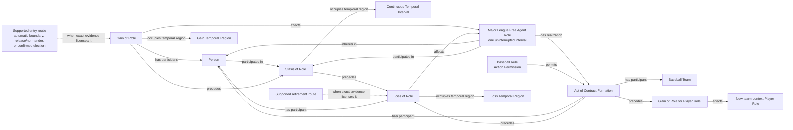

# Source-independent Mermaid

The Rule is the institutional grounding and permission; it is not a process
that repeatedly maintains the Person's status. Persistence is represented by
the Stasis of Role involving both the Person and exact Role. Contract formation
may realize the free-agent Role and then precede its Loss and the Gain of a new
team-context Player Role.

The dashed entry and retirement edges are guarded consequences. A provider
label does not select one route, and absence of a team-context Player Role does
not create the free-agent Role.

