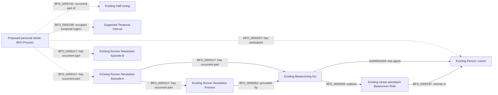
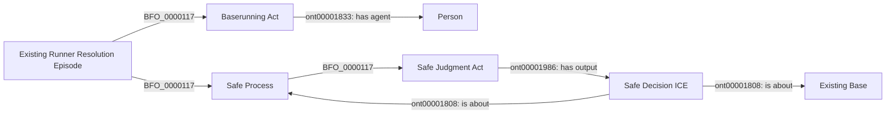

# Runner continuity and boundary projection: C1 and C2

Status: **accepted C1 and C2, 2026-09-09**. The user answered C1: Yes; C2: Yes, as long as you do not make an OP. The proposal text below records the reviewed scope; the decision does not assert that current source history is complete. The accepted
[verified-history criterion](../metric-suite-gap-answers-2026-09-09/continuity-decision.json)
settles the required evidence standard. It does not accept the graph grain or
boundary projection proposed here. Neither proposal introduces an object
property, ontology class, or source-specific ICE subclass.

## C1: represent the personal whole as an existing BFO Process

Proposed competency-question answer: one person's complete trip around the
bases is represented by a particular `obo:BFO_0000015` Process. It has the
supported `base:RunnerResolutionEpisode` instances as occurrent parts and is
an occurrent part of the relevant Half Inning. It has the runner as a
participant and occupies its supported Temporal Interval. This is an explicit
proposal for a new instance grain using existing vocabulary, not an already
accepted graph assertion.

Identity follows the accepted lifetime: becoming a baserunner through score,
out, replacement or inning end, with the independently verified complete
history required throughout. Re-entry or replacement begins another personal
whole. Source row positions, PA identifiers and career-persistent Roles do
not determine this whole's identity. Concrete IRI serialization follows review
and supported entry/termination anchors; no candidate production IRI is minted.

Do not reuse Runner Resolution Episode for this whole. That class identifies
one act/resolution pair and has qualified cardinality one for each. The whole
may have several such episodes across PAs. It must not be placed entirely
inside one PA merely because one of its episodes is part of that PA.

The whole is not inferred to be an Act or Planned Act from its parts. Agent
and Role realization assertions remain on the independently supported acts.
The whole's participant assertion does not exclude adjudicators or other
participants; the focal runner is identified through the runner acts' agents.
Every included runner episode must concern that same focal Person.

Dotted edges are the C1 proposal. Solid edges reuse supported existing
patterns, not claims that every source record contains every edge. Prefixes:
`BFO_` is `http://purl.obolibrary.org/obo/`; `ont` is
`https://www.commoncoreontologies.org/`. No edge asserts that consecutive
episodes strictly precede each other. BFO precedence requires non-overlapping
temporal extents; ordered source indexes alone do not establish that relation.

Contribution episodes retain their own existing act, resolution, contact-play
or causal/normative award structure. The personal whole does not become one
batter-attributed consequence. A steal followed by a teammate's single remains
two contributions. The accepted terminal-out formula applies within its
accepted attributed-consequence scope, not retroactively to every earlier
contribution in the runner's whole trip.

## C2: derive a metric boundary state from a verified history

Proposed competency-question answer: a supported safe destination can supply
the runner's metric base at a later evaluation boundary if the independently
verified complete intervening history establishes that no movement, operative
correction, out, score, replacement or inning ending changed that state. This
adds a specific state-projection rule to the already accepted continuity
criterion. Acceptance of continuity alone did not accept that rule.

Use the existing Safe Decision pattern for its actual adjudicated situation:

The decision remains about its own Safe Process and Base. Do not attach it
to a later process to make it appear that a new safe adjudication occurred.
The later state is an analytical projection over reviewed history and boundary
evidence, not a new RDF Person-to-Base relation. Do not create a Safe Process,
stasis, touching event, location assertion or information record to fill an
unchanged runner's missing row.

The evaluation boundary must be supported independently of this projection.
PAQ-A uses the immediate pre-consequence state. Erosion uses the accepted
actual end state; runners evidenced as stranded on the third out receive
erosion without a fabricated out or destruction. Clearing the bases for the
next half inning must not erase the identified stranded participants. A
counted Run Process and an Out Process remain distinct terminal outcomes.
Unknown boundary placement, review effects or coverage withholds the score.

## Source evidence and field selection

Owner: `mlb-game`; no new source lane. The unchanged checked-in source
`data/raw/samples/2026-08-23/824315.json` has SHA-256
`5fcc75d37a20a516d312b3bfb3d5cefb4371ebafa639851ff16173d9b1a6607c`.
Its hash was checked against the existing
[bounded excerpts](../../../proposals/mlb-game-batter-consequence-attribution/boundary-state-evidence.json).

| Existing evidence | Observation | What it does not prove |
| --- | --- | --- |
| PAs 34 and 35 | Both report runner 800050 at third after the PA; PA 35 has nine event entries and only the batter's runner row. | Complete intervening coverage or state immediately before the batter consequence. |
| PAs 15 and 16 | PA 15 reports runners at second and third. PA 16 has four event entries, one runner row, and no post-base fields. | That the omitted runners scored, were out, disappeared before the third out, or remained stranded. |
| `about.isComplete` in these four PAs | All four values are true. | Exhaustive movements, review/correction history, boundary state or source-to-graph coverage. |

| Field or product | Selection | Bounded use and missing-value behavior |
| --- | --- | --- |
| Game/PA/half-inning keys and runner IDs | Identity/join-only | Reuse accepted persistent identities and event scope; matching keys are insufficient continuity proof. |
| Runner `movement.start`, `end`, `isOut`, `outNumber`; scoring flag | Already supplied | Reuse admitted origin, Safe/Out/Run patterns. Missing remains unknown; out ordinal is not an additive count. |
| Runner `details.playIndex` and event `index` | Identity/join-only | Reconcile source membership and uniqueness; never infer causation or strict temporal precedence from index order. |
| `matchup.postOnFirst/Second/Third` | Already supplied | Positive post-PA reports only. Omission is not an empty base or unchanged state. |
| PA/event count and timestamp fields | Already supplied | Preserve each field's own scope and precision. PA 35's terminal pitch reports one out while the PA reports two. |
| Review and substitution records in the owning payload | Already supplied where present; interpretation unresolved | Their operative identities and effects must be accounted for. Absence alone cannot prove that none occurred. |
| Complete intervening history | Unresolved evidence product | The accepted criterion is required; the observed row counts do not certify it. |
| Personal whole and boundary projection | Unresolved graph/analytical contract | C1 and C2 require review before executable implementation. No duplicate provider field or new ICE is a substitute. |

This inventory adds no field from another provider. Missing mappings of fields
already in the authoritative payload remain owning-lane coverage debt.

## Implementation after review

After acceptance is recorded and pushed, implement the admitted source
identity and graph pattern, source-specific Mermaid and RML, and owning-source
SHACL. SHACL must enforce same-runner episode membership, appropriate half
inning, supported temporal scope and compatible terminal structure over the
reviewed graph contract. Do not duplicate those semantic decisions in an
imperative graph validator.

NiFi must retain separate evidence for acquisition coverage, source-to-graph
coverage and the analytical population. Counts of the rows a mapping happens
to emit cannot certify any of them. Reconciliation mechanics belong to the
existing source lane after its inputs and completeness contract are settled;
no new flow topology or ad hoc completeness predicate is proposed here.

Use SPARQL regression cases for C2 and the separate contribution scopes:
safe then no change; safe then steal; safe then out; passed-ball score during
strikeout; third-out stranding; pinch runner; missing event; ambiguous ordering;
and operative review correction. Prove a one-record/one-game fixture before
NiFi performs bounded corpus promotion and serving materialization.

C1/C2 address shared B1/B2 dependencies. They do not settle the remaining
operative-review identity, complete season populations, exact pitch/defensive
act evidence or deferred error-speed/interference extensions. The full suite
must continue to report those gaps until independently resolved.
