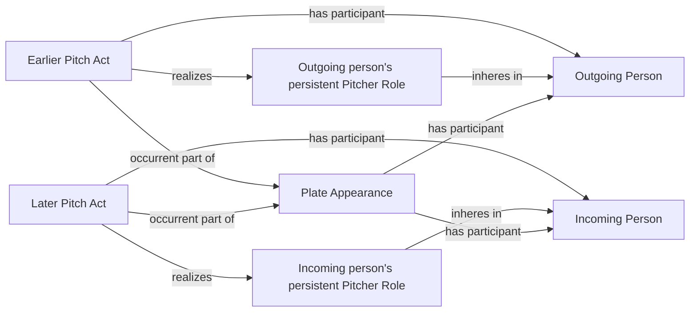

# Existing participation and realization pattern

This reuses BFO participation, realization, inherence and occurrent parthood.
It creates no new relation, role identity or temporal-order assertion.
The existing Stasis of Role pattern persists; a stasis does not realize a Role.
