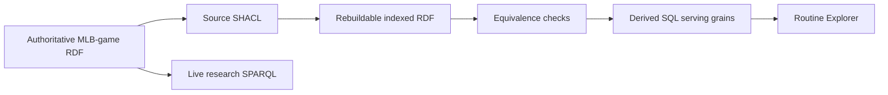

# Source-independent implementation boundary

The arrows describe dependency and promotion order. They do not introduce ontology relations. The authoritative RDF remains persistent; the indexed RDF and SQL products remain rebuildable.
