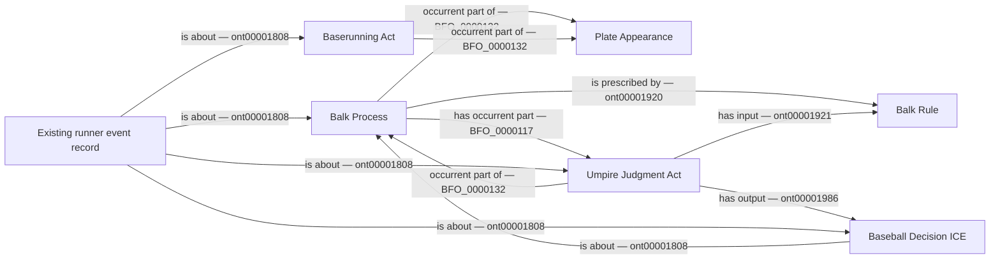

# BK1 review pattern

All named classes and relations already exist. This diagram proposes their
application to a separately recorded balk; it is not executable authorization.

The existing record joins the independently evidenced running act to the
adjudicated balk. This does not assert that every part of the PA caused every
other part. Existing runner, role, origin, safe/run resolution and episode
patterns remain in place. The final batting result is not the Balk Process.
No umpire bearer is invented when the source does not identify the caller.
