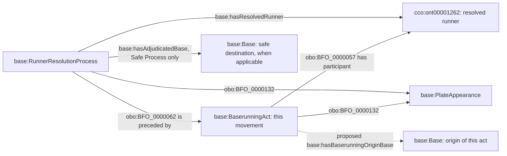

# A3: origin of the particular baserunning act

Status: **under review**. This is a concrete next relation candidate, not an
accepted extension of the PA-start location stasis.

## Recommended relation

`base:hasBaserunningOriginBase` relates a particular `base:BaserunningAct`
to the `base:Base` from which its runner undertakes the advance or retreat,
with respect to the rule-governed progression among bases in that Game.

The referents are the existing intentional baserunning act and the particular
Base artifact that marks the legally significant baserunning location. The
relation is scoped to the beginning of that act, rather than to the whole PA
or to the Person for an indefinitely continuing interval. It does not assert
physical contact with the artifact, a spatial coordinate, a right to remain
at the base throughout the act, or a new Role. A lead off the base therefore
does not by itself change the act's origin base.

This is a proposed primitive relation over independently accepted terms,
defined in [baserunning-origin.ttl](baserunning-origin.ttl). No new class is
proposed. In particular, no undefined state is placed inside an ICE or a
Stasis, and the existing career-persistent Baserunner Role is retained.

## Why this is narrower than reconstructing a persistent state

The specific movement's origin can be positively evidenced even when the
payload does not establish the runner's location or entitlement at every
instant between two plays. The relation describes the act being resolved.
It does not carry the most recent Safe Process forward by default.

Existing `is preceded by` connects the resolution to the baserunning act;
it does not identify the act's starting Base. `occurs at` describes the
location of a process as a whole. `has participant` does not distinguish an
origin Base from another involved Base. CCO `process starts`
(`ont00001933`) is a causal Process-to-Process relation, not an origin link.
The accepted `hasAdjudicatedBase` describes the resolution's safe destination.
None of these relations supplies the proposed act-to-origin assertion.

## Positive source evidence

Checked-in file: `data/raw/samples/2026-08-23/824315.json`.
Raw SHA-256: `5fcc75d37a20a516d312b3bfb3d5cefb4371ebafa639851ff16173d9b1a6607c`.
This example was located in a bounded search of 30 checked-in game payloads.
Both teams identify sport 1 and the game identifies regular-season type R.

| PA / runner | Earlier independent row | Later single row | Required distinction |
| --- | --- | --- | --- |
| PA 12 / 677587 | Row 0, event 6, first to second, stolen base | Row 2, event 8, second to third, single | The later act's origin is second, although the runner began the PA on first. |
| PA 64 / 682657 | Row 0, event 4, first to second, stolen base | Row 2, event 6, second to third, single | A second occurrence of the same distinction. |

For the single's runner-progress component in the supplied specification,
second to third gives `(3-2)/(4-2) = 1/2`. Incorrectly using first gives
`(3-1)/(4-1) = 2/3`. These are analytical expectations for review, not scores
computed from the production RDF. Full PA TFS additionally needs complete
participant and out evidence.

## Source selection and missing values

This uses the existing owning lane's `movement.start`, `movement.originBase`,
runner identity, event association, act identity and terminal resolution.
All are already supplied or identity/join inputs; another provider is not
needed. The field selection inventory retains them as unresolved until this
particular interpretation is accepted.

For the first bounded mapping subset, require a known runner, a supported
existing Baserunning Act, an unambiguous runner-row/event association, and
matching non-null `start` and `originBase` values in 1B/2B/3B. Withhold
disagreement, an unsupported token, an ambiguous placeholder, or a missing
value. Do not use the last Safe Process to fill a missing start. This subset
does not claim complete coverage of all movement records.

A batter row's null origin does not establish a Home Plate origin relation.
The metric's HOME=0 is a query-layer starting convention for the identified
batter's new trajectory; it is not a physical-location assertion derived from
null. A pinch runner is a different Person; this relation does not transfer
trajectory identity from a replaced runner.

## Source-independent shape

Origin is qualified by the particular act; destination is qualified by the
particular adjudication. A process interval can use accepted temporal-region
relations when evidenced. The source event's timestamps must not be copied
as exact act/adjudication endpoints without that precision being supported.

## Proposed conformance obligations

After acceptance, source SHACL must require an origin link to have a
Baserunning Act subject and one particular first/second/third Base object.
The act and the resolution that identifies its runner must share PA/Game
context and the same runner. The base must belong to that act's field context.
An origin link must have source-record evidence about the particular act.
The Base's first/second/third identity must be available through the accepted
Code Identifier pattern, rather than inferred by a metric from the IRI text.

These are constraints on linked acts, not a claim that all acts must have a
known origin. SHACL must preserve unknowns instead of deriving a start from
absence of an earlier event.

## Remaining completeness boundary

This relation would support the origin of one evidenced movement. To use it
as the immediate-before state of a whole attributed consequence, the query
must also establish that the act is the first relevant movement in that
consequence. Multiple rows require a reviewed continuity/coalescence contract.
Their array adjacency or shared runner alone does not establish it.

An unchanged runner has no movement origin to read. Absence of a row does not
assert unchanged state. A3 therefore remains incomplete for erosion across
all participants until an explicit boundary/completeness pattern is reviewed.
The new relation is useful without claiming to settle those additional facts.
