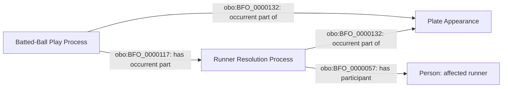

# A1 accepted source-independent shape

The boxes denote particular instances of the named accepted classes.

The contact play and runner resolution already exist under their accepted
identities. Only the first edge is added. The edge expresses parthood and
does not determine attribution, causation, destination or persistence.
No stasis or new ontology term is introduced by this accepted slice.
