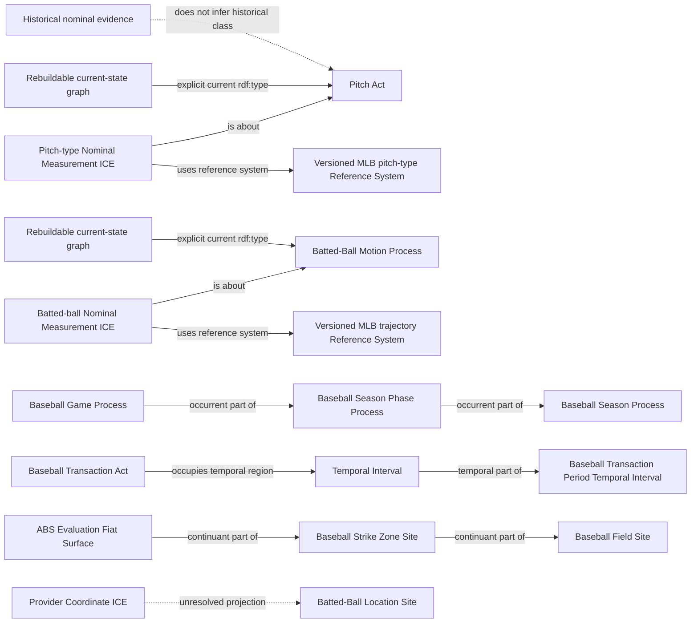

# Accepted implementation boundary

This is an administrative composition of the three accepted source-independent
Mermaid packages. Solid edges are authorized; dotted edges remain blocked.

```mermaid
flowchart LR
    PitchICE[Pitch-type Nominal Measurement ICE] -->|is about| Pitch[Pitch Act]
    PitchICE -->|uses reference system| PitchRS[Versioned MLB pitch-type Reference System]
    PitchIndex[Rebuildable current-state graph] -->|explicit current rdf:type| Pitch

    TrajectoryICE[Batted-ball Nominal Measurement ICE] -->|is about| Motion[Batted-Ball Motion Process]
    TrajectoryICE -->|uses reference system| TrajectoryRS[Versioned MLB trajectory Reference System]
    MotionIndex[Rebuildable current-state graph] -->|explicit current rdf:type| Motion

    Game[Baseball Game Process] -->|occurrent part of| Phase[Baseball Season Phase Process]
    Phase -->|occurrent part of| Season[Baseball Season Process]
    TransactionAct[Baseball Transaction Act] -->|occupies temporal region| ActInterval[Temporal Interval]
    ActInterval -->|temporal part of| TransactionPeriod[Baseball Transaction Period Temporal Interval]

    StrikeZone[Baseball Strike Zone Site] -->|continuant part of| Field[Baseball Field Site]
    ABSSurface[ABS Evaluation Fiat Surface] -->|continuant part of| StrikeZone

    CoordinateICE[Provider Coordinate ICE] -. unresolved projection .-> WorldSite[Batted-Ball Location Site]
    HistoricalICE[Historical nominal evidence] -. does not infer historical class .-> Pitch
```
