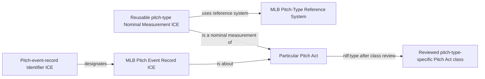
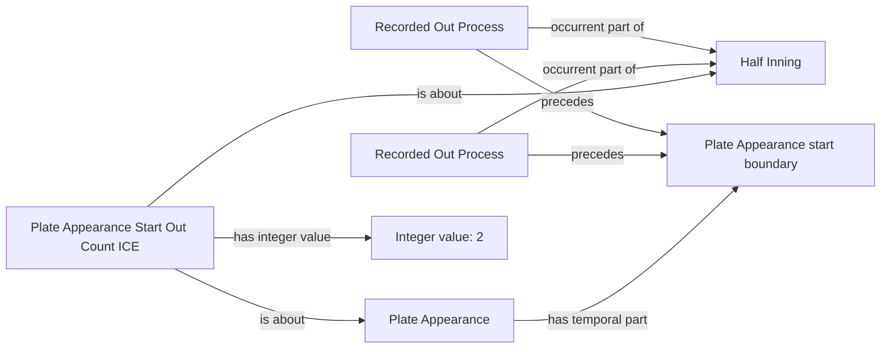
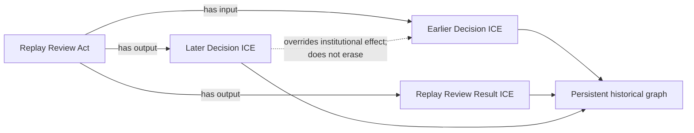
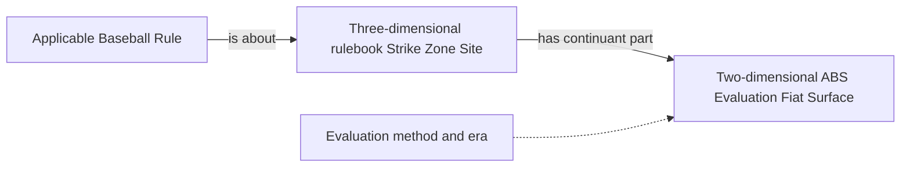
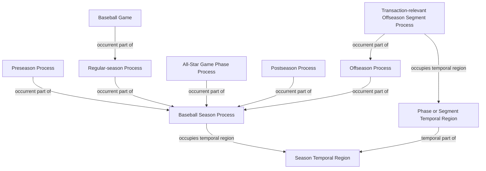

# Accepted source-independent patterns

## Pitch type and record identity

## Count anchored in recorded outs

## Replay history is preserved

## Strike-zone structures

## Season, phases, and offseason segments

