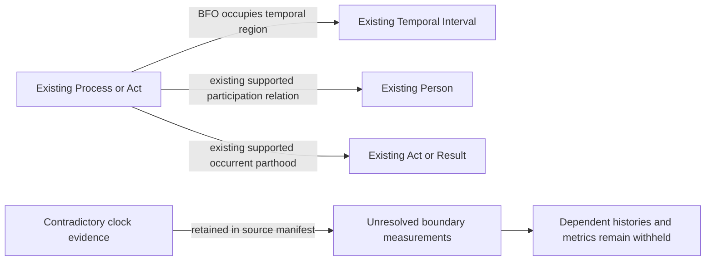

# T1: isolate contradictory source clocks

Status: accepted by Carter Beau Benson on September 17, 2026. The explicit
answer was "Approve T1 timestamp fix." Implementation follows this separately
published decision. No classes or properties are proposed.

## Accepted decision

For an explicitly contradictory start/end pair, withhold both clock values
as measurements of that interval's boundaries. Preserve the existing Process,
Temporal Interval, and independently evidenced acts, participants, decisions
and results. Retain the unmodified source and an exact conflict manifest.
Do not swap values, clamp them, borrow a neighboring timestamp, or interpret
source array order as BFO precedence.

Evaluate each existing runner-history and metric admission against its actual
dependencies. A history that needs the disputed temporal bound stays withheld;
its absence must remain visible in the completeness census. Independently
conforming evidence may pass graph promotion. This is not permission to mark an
incomplete runner population complete or to publish a leaderboard with missing
required observations.

This changes the current whole-source rejection policy and the selection of
timestamp measurements in RML/context, so it needs explicit review. The
accepted lifecycle and all unrelated semantic contracts remain in place.

## Source evidence and competency questions

The exact quarantined responses and reconciliation reports are recorded by
hash in `source-evidence.json`. A read-only check of MLB's live-feed endpoint
on September 17, 2026 still returned each contradiction:

| Game | Source location | UTC start | UTC end |
| --- | --- | --- | --- |
| 822753 | PA 49, pitch event 7 | Apr 8 21:52:44.346 | Apr 8 21:52:35.327 |
| 823302 | PA 46, automatic-ball event 0 | May 20 03:14:49.328 | May 20 03:14:41.599 |
| 823532 | PA 7, automatic-ball event 0 | Jun 20 17:53:18.781 | Jun 20 17:53:12.945 |
| 823631 | PA 46 header | May 14 00:53:14.052 | May 14 00:53:06.455 |

1. Does a contradictory pair license choosing the correct member? No. Both
   boundary measurements are unsupported for this interval; neither is repaired.
2. Does it erase an independently evidenced walk, double, award or runner out?
   Accepted answer: no. Preserve supported assertions at their accepted grains.
3. Can source record order substitute for physical temporal precedence? No.
4. Can missing timing or a withheld history be treated as complete evidence?
   No. Admission remains explicitly incomplete wherever that dependency matters.

## Field selection inventory

| Field / evidence | Selection | Proposed use |
| --- | --- | --- |
| `about.startTime/endTime`, event `startTime/endTime` | already supplied; contradictory pairs unresolved | Retain source evidence; omit unsupported boundary-measurement assertions for the affected pair |
| Other consistent clock pairs | already supplied | Preserve current mappings and validation |
| Event IDs, PA IDs, participant IDs | identity/join-only | Preserve accepted identities, including correction checks |
| Pitch/action indexes and runner membership | already supplied | Reconcile membership; never invent BFO precedence |
| Outcome, scoring and runner evidence | already supplied | Existing rules only, independently validated |
| Corrected clock or alternative physical timestamp | unresolved | No inference or acquisition of another source is proposed |

## Source-independent structure

The last two edges describe pipeline evidence handling, not RDF predicates.
No new RDF predicate or substitute information class is introduced.

## Source-specific implementation and proof after acceptance

The context builder selects only independently supported clock pairs for the
existing PA/pitch timestamp maps. Automatic-award and runner-history temporal
inputs apply the same selection. Source reconciliation preserves every conflict
but distinguishes membership conformance from timing availability. Source-owned
SHACL checks absence of the unsupported timestamp measurements and all preserved
process/participant/result structure. Existing admission proofs still reject
incomplete dependent populations.

Require a one-record fixture for each of the four cases, one-game RML and SHACL
proof, exact source/graph census, unchanged raw hashes and a correction regression
before NiFi replay. Inspect all affected temporal constraints before committing
the implementation. An unforeseen identity or boundary dependency remains a gap.
