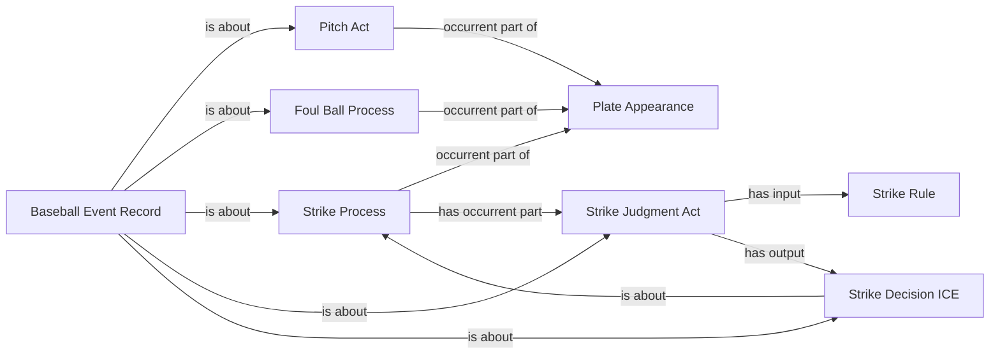

# Existing world-side pattern for review

All nodes are instances of accepted classes. Relations use accepted BFO/CCO
terms; arrows do not introduce predicates or a new identity criterion.

The full existing physical/contact, location, participation and rule pattern
remains in effect; this diagram identifies the counted-strike portion being
selected. M4 additionally requires the existing actual Bunt Attempt Act and
contact structure. Neither a source count nor a review record replaces these
world-side processes. No separate-event order follows from this diagram.
