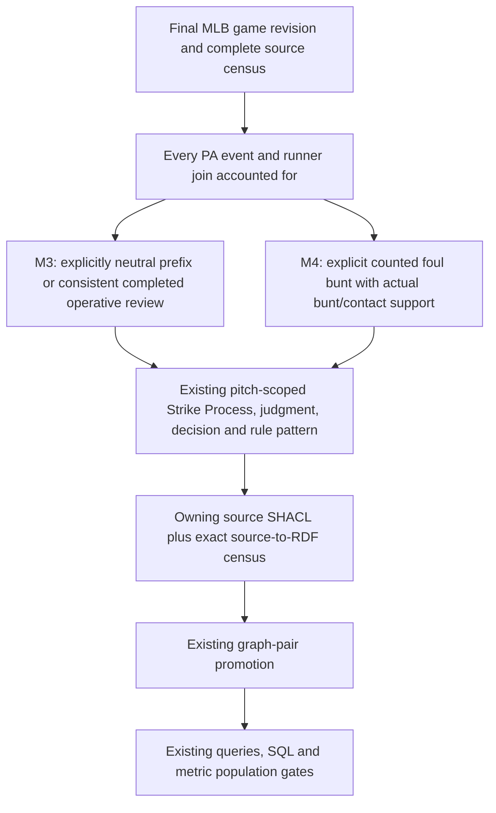

# Source-specific review projection

This diagram describes selection and validation steps, not ontology predicates.
It changes neither the module boundary nor the accepted lifecycle.

For game 824087, candidate pitch IDs come from PA/event pairs 37/3, 64/2,
65/2 and 72/0. Exact identities are retained in `source-capture.json`.
Unsupported prefixes stay withheld. The final review call supports the
operative count; this does not create an original review judgment.
