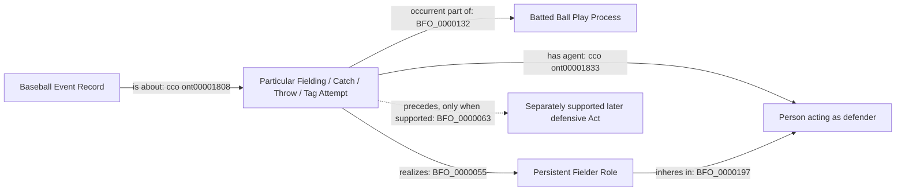

# D1 world-side shape (review only)

All labels resolve to accepted terms. The disjunction in the Act box is a
review illustration, not a new class. A catch and its Fielding Attempt
supertype identify one particular; separate throws have distinct identities.
Temporal precedence is not inferred from diagram placement or source order.
