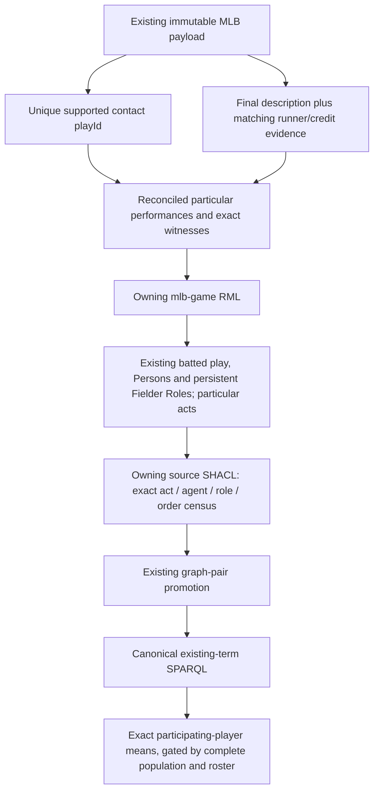

# D1 MLB projection (review only)

This illustrates the already accepted lifecycle, not a new lane or an RDF
schema. Selection is proposed for review; no executable D1 selector or RML
is installed by this package. Whole-play completeness is a separate positive
proof, and unselected plays remain visible to its census.
