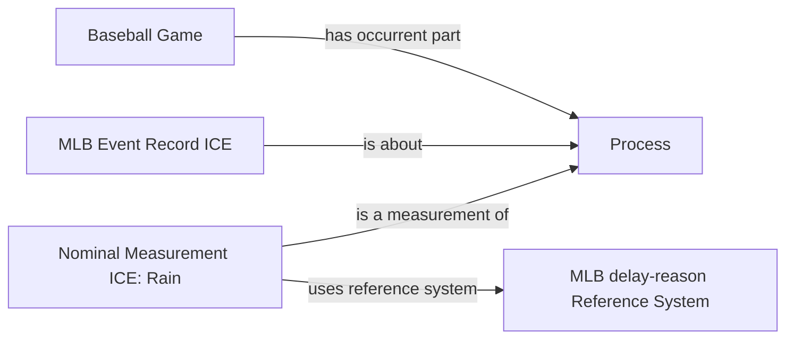

# Source-independent Mermaid

Solid edges are accepted. The weather-causation edge is deliberately absent.

```mermaid
flowchart LR
    PERSON[Person]
    ROLE[Umpire Role]
    GAME[Baseball Game]
    NAME[optional Name ICE]

    PERSON -->|bearer of| ROLE
    PERSON -->|participates in| GAME
    ROLE -->|participates in| GAME
    NAME -. only when supplied .->|designates| PERSON
```

```mermaid
flowchart LR
    CHALLENGER[Player]
    CHALLENGE[Challenge Act]
    REVIEW[Review Act]
    REVIEWED[reviewed Pitch or Call]
    DECISION[resulting Decision ICE]
    STATUS[optional confirmed or overturned classification]

    CHALLENGER -->|agent in| CHALLENGE
    CHALLENGE -->|occurrent part of| REVIEW
    REVIEW -->|has input| REVIEWED
    REVIEW -->|has output| DECISION
    DECISION -. only when source states status .->|classified by| STATUS
```

```mermaid
flowchart LR
    GAME2[Baseball Game]
    PA[incomplete Plate Appearance Process]
    PITCH[Pitch Act]
    RESULT[terminal Plate Appearance Result]

    GAME2 -->|has occurrent part| PA
    PA -->|has occurrent part| PITCH
    PA -. absent when not evidenced .->|has output| RESULT
```



The generic Process is intentionally not promoted to a new BaseballO class in
this package. The nominal reason is queryable while the graph remains neutral
about an unevidenced atmospheric cause.
