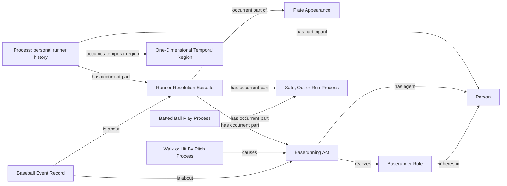

# EG1: targeted existing-pattern completion for Empty Games

Accepted by Carter Beau Benson on October 5, 2026: **Approve and Approve**,
in direct response to the named EG1 and BK1 requests. This decision authorizes
bounded acquisition and additive execution of existing MLB-game mappings. It
proposes no ontology terms, object properties, identity rules, mapping selectors
or semantic freeze changes.

## Accepted scope

Finish the existing-pattern repairs needed by Empty Games for the player-games
in [the candidate inventory](candidate-inventory.json): 700 currently excluded
player-games in 455 regular-season games, from SQL publication
`20261005T141801Z-dashboard-b67ca16201fc`. This is a diagnostic candidate scope,
not a claim that 455 games need RDF changes or that every case is repairable.

NiFi must first consume the independently verified eligibility and retained
runner-check reader repairs (`e92109b` and `583006a`). Remove candidates whose
Empty Game classification is then complete. For remaining candidates, use
retained input when available. If it has been retired, acquire one current MLB
game response for that named game under this bounded request. Do not acquire
the rest of the season or restart normal ingestion.

Use only the existing, reviewed mappings for the exact PA/runner facts needed
by those excluded players, plus their complete accepted dependencies:

- Official PA/result/Batter Act participation, including the accepted K1
  compound-result pattern when its unchanged selector supports the case.
- Runner acts, episodes, resolutions, agents, origins and destinations.
- Supported contact and Walk/HBP attribution, with existing rule and record
  dependencies. A result label alone does not establish an attribution link.
- Complete accepted personal histories and their memberships where needed to
  reconcile several segments. Retain existing T1 clock behavior.

Reuse the R1/K1 source-owned additive workers and their existing SHACL profiles.
Calculate missing triples against the pinned current graph, validate the
affected pattern plus its dependencies, and add only those absent triples.
Preserve every existing triple and raw source byte. A source conflict or an
unsupported selector stops that candidate; it does not trigger replacement.
NiFi owns hashes, manifests, retry/quarantine and refresh of affected derived
products. Successful input retirement follows the existing promotion policy.

This does not authorize whole-game or whole-season graph replacement, ontology
changes, new properties, inferred attribution from labels, unrelated defensive
or pitch repairs, or a blanket RML/context rerun. Normal daily acquisition is
unchanged. Ordinary engineering to select these facts and dependencies is part
of the scope; approval is not required again for individual implementation files.

## Evidence and questions answered by the proposed scope

The measured full-season card currently ranks 291 players. The inventory has
407 player-game classification exclusions and 293 unknown PA totals. The
eligibility repair can resolve some unknown-count exclusions without any RDF
change because this metric needs at least one verified PA, not an exact rate
denominator. Known zero totals must remain included without an appearance minimum.

Read-only checks of promoted RDF confirm two concrete attribution omissions:

| Game / PA | Existing facts | Absent required link |
| --- | --- | --- |
| 822774 / 45 | Walk Process, batter 502671's running act, Safe Process and first-base destination | Award causes running act and its supporting rule pattern |
| 824147 / 60 | HBP Process, batter 514888's running act and Safe Process; other runner advances | Supported award/force-chain attribution |

The retained SQL has the same omissions. Therefore these examples are not
fixed by changing a SPARQL join. A newly acquired response is a separately
identified witness, not a replacement for the original source. Only an exact
match to existing game, PA, runner, act and outcome identities can support an
addition under unchanged selectors. This proposal does not assert that those
selectors will accept either example before the source is checked.

Game 822748 has a different problem: its retained complete runner check already
matches current RDF. The published reader repair preserves its distinct source
identity and needs no RDF addition. That distinction is why NiFi must skip
resolved candidates before acquisition or mapping.

## Remaining semantic boundaries

[BK1](../mlb-game-balk-runner-attribution/README.md) separately proposes the
generic mapping for explicitly recorded balks before a later batting result.
BK1 was separately accepted in the same user response; its selector remains a
separate implementation scope from EG1. Game 823895 PA
64 supplies another retained example: two balk advances precede a flyout, and
the graph lacks the balk attribution. The batting out does not assign those
advances to the batter.

The existing runner census also rejects some null strikeout records followed
by a safe WP/PB movement and a later error advance beyond first. For example,
823712 PA 4 and 823448 PA 26 have those three records. The currently reviewed
two-record nonmovement selector cannot simply be widened under this unchanged-
selector execution request. Preserve that exact gap for review if it still
changes a player's classification after the independent reader repairs.

EG1 is not a declaration that Empty Games is finished or that every remaining
semantic boundary is approved. The delivery outcome remains complete selected-
range SQL counts for every eligible player, including zeroes, with identical
card/detail rankings and no hidden unresolved player-games.

## Existing field and pattern inventory

| Existing source evidence | Classification | Use |
| --- | --- | --- |
| Game, PA, event and runner identities | Identity/join-only | Match the graph's accepted referents |
| Official result, actual batting and roster participation | Already supplied; coverage/check debt | Establish eligibility without guessing credit across a replacement |
| Runner origin, destination, out and scoring flags | Already supplied; mapping coverage debt | Existing endpoint/episode patterns |
| Contact/event joins and award/force evidence | Already supplied; mapping coverage debt | Existing attribution selectors |
| Reconciled history members and temporal boundaries | Derivable by the accepted source owner | Existing complete history dependencies; no invented clocks |
| Unmatched identities, unreviewed selector variants | Unresolved | Keep the affected classification unknown |

The world-side patterns are unchanged from the accepted
[R1 decision](../mlb-game-runner-pattern-completion/README.md),
[K1 decision](../mlb-game-strikeout-double-play/README.md),
and their reviewed source-independent diagrams. This package expands bounded
execution scope only; it does not create a new modeling proposal for those patterns.

The following unchanged R1 diagram identifies those existing referents; it is
not a new source-independent modeling decision. The alternatives are existing
types selected by the current mappings, not proposed common superclasses.

