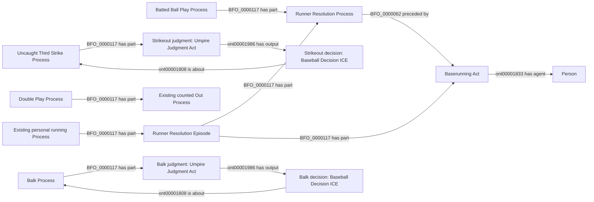

# EG2: five remaining selections over existing game patterns

**Accepted October 9, 2026.** User reply: "Approve EG2 targeted fixes".
The reviewed scope below is accepted, including generic future-game handling,
targeted additive repair through the existing NiFi owner, analytical integration
and the scoped semantic pin updates needed for implementation. No new ontology
classes or object properties, full rebuild, or unrelated RDF replacement.

The following is the proposal text accepted by that decision; its former
review-status and future-tense language are historical. Implementation status
belongs in the active roadmap and metric readiness record.

Status: **under review**, October 8, 2026. No implementation or approval is
implied by this package. These are mapping-coverage repairs in the existing
MLB Game lane, not new sources. No ontology class or property is proposed.

The current Empty Games work has exposed five narrow source-selection
boundaries that the earlier packages explicitly excluded. This package asks
for those selections together. It does not authorize a full rebuild, replacing
games, changing metric weights, or treating unknown contributions as zero.

## Concrete decisions

| Selection | Existing witness | Requested change |
| --- | --- | --- |
| EG2a: contact after a reconciled administrative prefix | 822735 / PA 40: Luis Garcia Jr. singles; Keibert Ruiz is thrown out at home. A pinch hitter entered before the first pitch at 0-0. | Let B2's existing complete contact-continuation pattern survive a verified pre-turn substitution or an already reconciled review. Keep every terminal contact consequence, including outs. |
| EG2b: empty strikeout record with a later safe continuation | 823448 / PA 26: an all-null strikeout row, explicit passed-ball HOME-to-first row, and explicit first-to-second error row at the same terminal event. | Recognize the first row as a nonmovement record even when a separately evidenced safe continuation ends at second. Reuse the existing Uncaught Third Strike pattern; do not invent another running act. |
| EG2c: reviewed strikeout double play | 822729 / PA 51: a confirmed pitch-result challenge, strikeout and caught stealing, two distinct counted outs. | Permit K1's existing compound membership after the operative review reconciles. Do not infer a failed hit-and-run or invent a constituent Strikeout Process. |
| EG2d: hit-by-pitch after reconciled review | 824345 / PA 56 and 823396 / PA 80: an earlier reviewed running/pitch event followed by a distinct HBP. | Apply W5's already accepted review handling to the existing HBP award selector, retaining its own HBP/force-chain conditions. Do not credit the earlier running event to the batter. |
| EG2e: disengagement violation | 823247 / PA 21, 823426 / PA 91, 824664 / PA 4: explicit `forced_balk` with `violation.type=pitcher_disengagement`. | Apply the existing BK1 Balk Process/judgment/decision pattern to the enforced one-base award. Preserve the later batting result and independent runner credit. |

The exact selected-play excerpts and their retained-container/source hashes
are in [evidence.json](evidence.json). Some successful original inputs were
retired. Their hash-checked execution contexts are review evidence only, never
reconstructed ingestion inputs. Actual repairs must use checked original
responses retained or recovered under the existing bounded EG1 authority.

## Selection limits

**EG2a.** Reuse the accepted actual-batter participation and runner-history
reconcilers. A pre-turn PH replacement must be explicit, precede every pitch
and movement, have a 0-0 count, and leave exactly one actual batter for that
turn. A PR replacement must already have its accepted replacement/history
boundary and preserve the contact runner identities. A completed review must
be handled by the existing operative-review reconciler and agree with final
counts, runner identities and outcomes. Unrecognized or unfinished reviews
remain excluded. Preserve B2's unique terminal in-play event, complete runner
membership, nonbranching paths, accepted independent prefixes and terminal-out
coalescence. This does not admit error-only rows by their shared event index.

**EG2b.** Require one all-null, uncredited strikeout record; one explicit safe
WP/PB entry to first for that same batter; exactly one additional safe
first-to-second row; one unique common terminal pitch/event; three strikes;
an operative strikeout result with `isOut=false`; and the same batter in the
final second-base occupancy. Origins, destinations and scoring/out flags must
agree. Keep the extra row's original attribution unresolved unless an existing
accepted selector supplies it. No inference from null fields alone, no second
act for the placeholder, no guessed timestamp and no new positive error credit.

**EG2c.** Reuse K1's explicit joined strikeout/caught-stealing description,
distinct identified runners, terminal strike-three event, source out numbers,
and complete two-out reconciliation. Admit a completed, uniquely associated
operative review only when it leaves those conditions true. Header text alone,
a pending review or an inconsistent out total remains insufficient. Reuse the
existing compound whole, counted out processes and part relations.

**EG2d.** Reuse the existing HBP event identity, batter identity, first-base
destination, award rule, final occupancy, force-chain selection and absence of
conflicting attribution. W5's history-review reconciler may establish that an
earlier completed review is accounted for. It does not make the earlier steal
or caught-stealing part of the later award, or extend other award types.

**EG2e.** Require matching explicit action and runner `forced_balk` records,
the `pitcher_disengagement` violation subtype, one stable event identity,
the exact runner/event association, an occupied start and safe next-base or
scoring endpoint, no out, and existing operative-review reconciliation. Several
forced runners share the event's Balk Process and judgment. The source pitcher
is not an identified umpire. A successful pickoff, waived award, other clock
penalty or an extra advance beyond the awarded base is excluded.

MLB identifies a failed third disengagement as a balk with a one-base advance.
This supports EG2e's rule interpretation; the joined source records identify
each particular occurrence. [MLB balk and disengagement glossary](https://www.mlb.com/glossary/rules/balk).

## Field-level selection inventory

| Existing authoritative fields | Inventory status | Use |
| --- | --- | --- |
| Game, PA, player, play/action identifiers; unfiltered event and runner indexes | Identity/join-only | Preserve every existing identity and exact association |
| Result, call, pitch flags, counts, out numbers and final base occupants | Already supplied; coverage debt | Reconcile the final operative event and actual endpoints |
| Explicit PH/PR replacement, incoming/outgoing player, replacement count | Already supplied; accepted participation/history selectors | Distinguish a pre-turn change from multiple actual batting participants |
| Review completion, type, disposition and count/out association | Already supplied; accepted review selectors | Reuse existing review reconciliation, without inventing adjudications |
| Null K row plus complete WP/PB and continuation rows | Already supplied; coverage debt | Distinguish a nonmovement record from two actual movements |
| `forced_balk`, `violation.type`, runner start/end and event link | Already supplied; coverage debt | Select the existing enforced-balk pattern |
| Source totals, exact runner membership and event sequence | Already supplied | Existing source consistency and SHACL obligations |
| Official substituted-batter PA credit | Unresolved, outside EG2 | Do not equate every actual Batter Act with an official PA |
| Error-only positive contribution and HOME-entry running weights | Unresolved, outside EG2 | Do not change metric policy through a mapping repair |

There is no additional endpoint, provider, duplicate authority, new literal
encoding, proposed universal or new predicate in this package.

## Source-independent shapes using accepted terms

The diagram keeps the strikeout and balk judgments distinct. Existing HBP award/runner-membership shapes
remain unchanged; EG2d only expands the review-compatible source selection.
Administrative events are not parts or causes of the later contact consequence
merely because they occurred in the same PA.

## Execution after named acceptance

Record and push acceptance before implementation. Add generic selections to
the owning context/RML path and update only their scoped semantic pins. Use
the existing owning SHACL profiles and focused retained-case regressions.
NiFi's EG1 owner may reopen only still-incomplete inventoried player-games
matching an accepted selection, preserve existing RDF and add the exact absent
facts plus their existing dependencies. Successful unchanged games stay closed.
Future games use the same selectors. Refresh admissions and affected prepared
results through their existing owners; no API-to-SQL bypass or full rebuild.

This package is not a claim that these five selections alone settle all
remaining Empty Games. Independent-error attribution, official PA credit in
substituted turns, and the uncaught-third-strike entry metric decision remain
separate and must not be silently decided by this approval.
