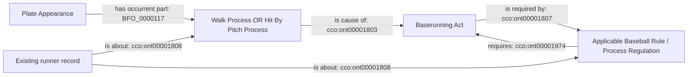

# Existing award pattern reused by W3

All terms are already accepted. The two result alternatives use their existing
classes; neither creates a new common superclass or relation.

The selected runner act retains its existing agent, persistent Baserunner Role,
resolution, Safe judgment/decision, destination and temporal dependencies.
An earlier pitch, steal, timer judgment, substitution or placement remains a
distinct event. A completed review supports the final operative award; this
selection does not assert the review's earlier call or new judgment identity.
Provider counters do not establish multiple actual pitches or judgments.
