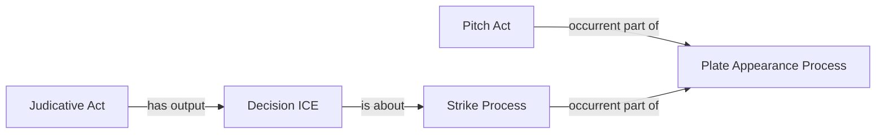

# Reused counted-foul pattern

No new relation or class is proposed. Substitutions and review records are
evidence for selecting a supported strike, not replacements for the actual act.

The exact executable predicates and classes remain those of the accepted
`FoulStrikeProcessMap`, `FoulStrikeProcessMapRecordAboutMap`,
`CountedFoulStrikeAdjudicationMap`, `CountedFoulStrikeDecisionMap` and
`CountedFoulStrikeProcessPartMap`. This diagram does not authorize changing
the earlier pitch's participant or combining separately reviewed acts.
