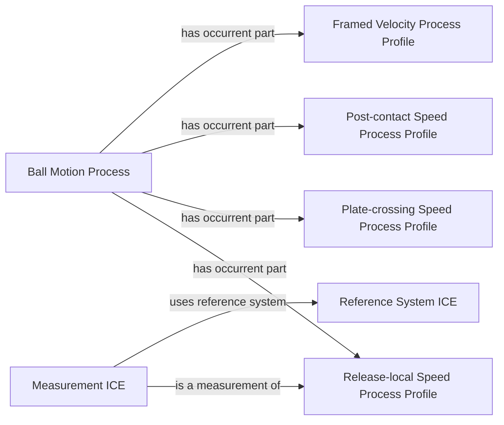
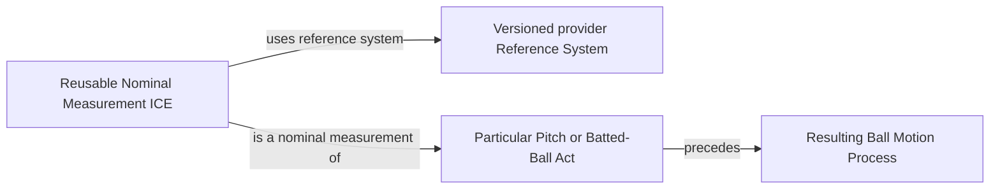
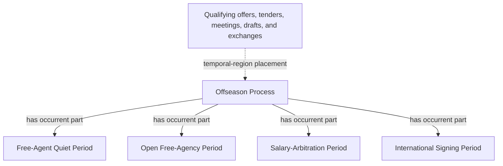

# Accepted source-independent shapes

The last edge is explanatory diagram notation, not a proposed object property.
Executable RDF must express temporal placement with accepted relations and
Temporal Regions.
