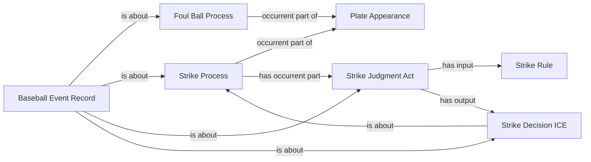
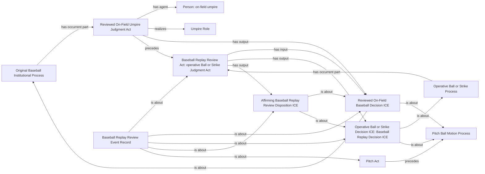

# Source-independent review shapes

All nodes denote particular instances of existing classes. Edge labels name
existing relations; no diagram label introduces a predicate. These shapes are
proposed, not accepted. They show M1/M2 only, not unresolved inventory entries.

## M1: one additional counted strike after a supported foul

This reuses the existing counted-foul pattern, whose full admitted relations
remain in effect. The source increment selects when the particular Strike
Process exists in the mapped institutional history. The number in the source
is not a newly modeled quality, state, or process. No precedence between
separate pitch events follows from an ordinal or the layout of this diagram.

## M2: distinct original and operative judgments about one pitched motion

J and A are different acts; D and V are different ICEs with the same affirmed
Ball/Strike content. C is the existing single operative counted process. The
Pitch Act and motion use their existing accepted relation. Review timing is
not assigned the pitch's exact interval, and the review is not an occurrent
part of the Pitch Act. The on-field umpire does not become the review agent
without evidence. No software agent, challenger agent or new persistent role
is inferred by this shape. Public affected-player attribution follows existing
actual batting participation at this pitch, with substitutions reconciled.
