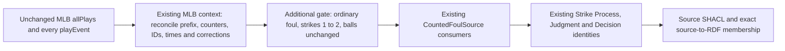
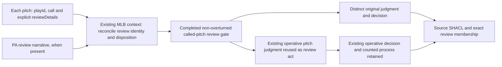

# Source-specific designs before executable mapping

These diagrams depict evidence selection and RDF output responsibilities.
Arrows here describe data processing, not RDF predicates. The actual semantic
edges are in the source-independent shapes and contract.

## M1

Changing only the iterator to `count.strikes == 2` is expressly rejected:
that would also admit the 46 held-count fouls in the inspected fixture.

## M2

The PA does not need a terminal review narrative. The particular pitch ID,
not the last pitch or a PA-only flag, selects the subject. A duplicate narrative
is reconciled into one canonical review; a separate out/safe review remains
separate. Existing PA review identities are preserved when already canonical.
Context chooses one identity for the operative judgment and all of its
references; it does not emit two identities and repair them with `owl:sameAs`.

No raw response is rewritten. Context remains disposable, and source, context,
mapping and graph hashes retain the existing provenance lifecycle. Source
SHACL precedes graph-pair promotion. Corpus work remains NiFi-owned.
