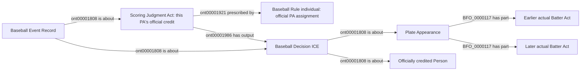

# EG4: official PA credit as a distinct scoring decision

**Accepted October 9, 2026.** User reply: "Approve EG4 official PA credit".
The reviewed scope below is accepted, including generic future-game handling,
targeted additive repair through the existing NiFi owner, analytical integration
and the scoped semantic pin updates needed for implementation. No new ontology
classes or object properties, full rebuild, or unrelated RDF replacement.

The following is the proposal text accepted by that decision; its former
review-status and future-tense language are historical. Implementation status
belongs in the active roadmap and metric readiness record.

Status: **under review**, October 8, 2026. This package proposes a graph pattern
using existing vocabulary. It creates no ontology class or object property.

Actual batting participation and official statistical credit are already
separate accepted meanings. The remaining seven eligibility records concern
substituted turns where the graph contains the actual Batter Acts but cannot
uniquely identify the officially credited person. This package asks for the
missing scoring-decision pattern, not for a change to Empty Games eligibility.

## Proposed pattern

Represent the official credit for a completed PA as an existing
`ScoringJudgmentAct`, prescribed by a `BaseballRule` individual for official
PA assignment, with output a `BaseballDecisionICE` about exactly that PA and
the credited Person. The retained `BaseballEventRecord` is about that judgment
and decision. Keep each person's actual Batter Act, pitches and swings intact.
The credited person is not asserted to be the scorer or an agent in someone
else's acts. Do not invent scorer identity or adjudication timestamps.

Identity is one operative official-PA-credit judgment/decision per game and
completed PA, separate from the batting-result and replay decisions. Use a
dedicated existing-rule individual, not a new `creditedTo` predicate or an
index-namespace replacement for one. Any conflicting credit remains unresolved.

## Selection and independent evidence

Require the accepted, fully reconciled substitution/actual-participation chain,
the count at replacement, a completed operative result, complete PA inventory
and agreement with the final per-person and team official batting totals.
Do not assign credit merely to every participating person or always to the
final matchup batter. Source totals independently constrain the graph; serving
counts the resulting graph decisions rather than copying boxscore totals.

Rule 9.15(b) assigns a completed strikeout to the outgoing batter when replaced
with two strikes; a different final outcome is assigned to the substitute.
The rest of the ordinary completed-turn rules remain. Repeated or ambiguous
replacement chains, inconsistent counts, unresolved reviews or mismatched
official totals remain withheld. [2026 Official Baseball Rules](https://mktg.mlbstatic.com/mlb/official-information/2026-official-baseball-rules.pdf).

The unchanged checked-in witness `data/raw/samples/2026-07-18/824169.json`,
PA 31, records Christian Walker's initial participation, his replacement by
LaMonte Wade Jr., and Wade's eventual reached-on-error outcome. The earlier
Batter Act does not give Walker this official PA. The source hash and selected
play/boxscore evidence are in [evidence.json](evidence.json).

Current affected game/player eligibility identities are 822854/695720,
823565/667670, 823671/702222, 823705/605170, 824374/676694, 824642/621020 and
824915/691373. The separate 822729 compound-result issue belongs to EG2c.
Do not hardcode these player identities as the generic selection criterion.

## Field inventory and competency questions

| Existing authoritative fields | Status | Purpose |
| --- | --- | --- |
| Game/PA identity, actual participants and replacement person IDs | Identity/join-only | Preserve actual actors and identify the credited person separately |
| Replacement count and completed result | Already supplied; coverage debt | Apply official credit rules to the actual replacement chain |
| Official per-person/team PA totals | Already supplied; independent reconciliation | Check the complete derived credit inventory, not direct SQL values |
| Final review disposition and count reconciliation | Already supplied | Select only the operative result |
| Scorer identity or decision timestamp | Unsupported | Omit; do not borrow a player identity or pitch timestamp |

- Can two people have actual Batter Acts while only one gets the PA? Yes.
- Can the outgoing batter receive the strikeout PA? Only under the supported
  official rule and reconciled source evidence.
- Does zero official PA mean Empty Games ineligibility? Yes, as already decided;
  separate running eligibility remains unchanged.
- Does the judgment move swings or contribution credit to the statistical
  recipient? No. Actual contributions still require their own supported acts.

## Bounded execution after named acceptance

Publish the accepted pattern/identity decision first. Add generic source-owned
RML and its existing-profile SHACL obligations. NiFi adds only missing credit
patterns and their accepted dependencies for affected substituted turns; it
does not remap ordinary games or replace existing RDF. SPARQL reads these
decisions for official eligibility/qualification and preserves actual-act
attribution. Refresh affected derived products through the current owner.

This proposal does not settle how to attribute a genuinely ambiguous positive
play, independent errors or an uncaught-third-strike running contribution.
