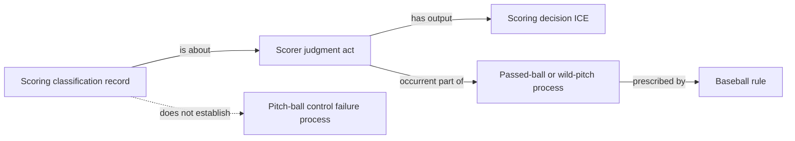

# Source-independent evidence boundary

The dotted edge is a prohibition, not an RDF assertion. A future source may support the physical process independently, but the MLB-game scoring classification does not.
