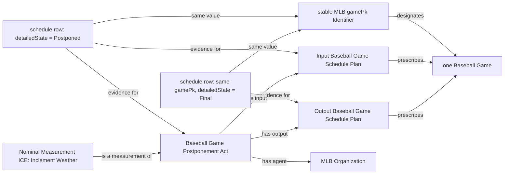

# MLB schedule source-specific Mermaid

The operational completed-game seed is deduplicated by `gamePk`. Detailed state
and revision fields determine which schedule occurrence supplies the revised
plan; abstract state `Final` is not sufficient.
