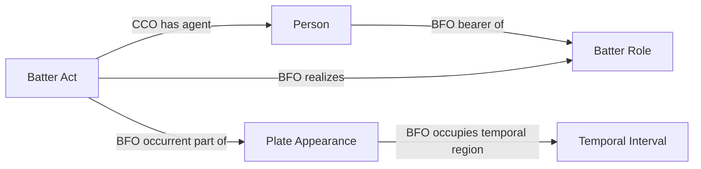

# Q5/Q6: the remaining MLB-game quarantine boundaries

Status: accepted by Carter Beau Benson on September 23, 2026. The user
answered "good do it" immediately after the explicit recommendation to approve
both Q5 and Q6. This decision authorizes their scoped implementation and
affected semantic-freeze pin updates, after this decision is published. No new class, object
property, data property, source endpoint or lifecycle topology is proposed.

Thirty of the 43 unresolved game quarantines can be retried using existing
fixes: 26 runner start-state role bindings, three substituted-batter index
cardinalities, and one context crash that no longer reproduces. This review
covers only the other 13. All 43 retain an older promoted graph until an
independently valid replacement is ready. Retained raw inputs are unchanged.

## Q5: a pinch hitter before the first pitch, with no outgoing player ID

Five retained inputs identify the incoming pinch hitter but omit
`replacedPlayer.id`: games 831432, 831445, 831631, 831799 and 831855. The
substitution is event zero, the count is 0–0, there are no preceding events,
and the incoming ID equals `matchup.batter.id`. The current context builder
crashes while trying to obtain an outgoing batter who need not have performed
any batting act in this plate appearance. One narrative even says a player
replaces himself; prose is not a substitute identity source.

Accepted decision Q5: in this exact initial-event case, use the explicitly
identified incoming batter for his subsequently evidenced batting acts under
the existing single-batter pattern. Do not manufacture an outgoing person,
an earlier batting act, a substitution transition, or a role change. An
unknown outgoing player does not erase the supported incoming player's acts.
All later substitutions retain the existing participant and timing checks.
Missing identity after any delivered pitch or automatic count award remains
unresolved. Official PA/AB attribution remains subject to the existing B1
admission, independently of actual participation; this proposal supplies no
missing official credit.

Competency questions:

1. Does the initial substitution alone prove the outgoing player batted? No.
2. May explicit subsequent pitches identify the incoming player's actual
   participation despite the missing outgoing ID? Accepted answer: yes, only
   for the exact initial-event conditions above.
3. May a narrative name or presumed lineup identity fill the missing ID? No.
4. Does this admit official PA credit or establish a role transition? No.

## Q6: incomplete source totals do not reject all independently valid RDF

Eight games have `INNING_RUN_TOTAL_MISMATCH` because an inning-side run total
is null; four also have an `INCOMPLETE_SOURCE_PLAY`. Games: 824295, 824807,
831526, 831555, 831559, 831564, 831629 and 831632. Their existing authoritative
SHACL passed, but the clock admission skipped its graph check and rejected
the entire update solely because the aggregate metric-source census was not
globally consistent. The runner-history admission currently has the same
whole-source dependency, so changing only the clock gate is insufficient.

Accepted decision Q6: retain those exact source inconsistencies, and allow
promotion of independently conforming RDF while withholding dependent
histories and metric populations. Run the applicable source-owned SHACL over
the graph, including exact clock values and any asserted runner histories.
Do not certify global source completeness. Do not interpret a null run total
as zero, call an incomplete play complete, infer a game result, or admit a
partial leaderboard population. Identity, event membership, timestamp
validity, and source-to-graph disagreements continue to block their affected
assertions; this decision is limited to these two completeness issue types.

Competency questions:

1. Is a null inning-side total evidence of zero runs? No.
2. Can a known pitch and its supported clock remain valid when another play
   is incomplete? Accepted answer: yes, subject to the existing graph contract.
3. Does passing graph conformance certify complete batting or running
   populations? No. The separate admission remains withheld.
4. Can a source-to-graph mismatch pass merely because the game is incomplete?
   No. Both conformance and completeness remain explicit, separate outcomes.

## Field selection and existing patterns

| Evidence | Classification | Proposed treatment |
| --- | --- | --- |
| Incoming player ID and matchup ID | identity/join-only, already supplied | Existing Person and persistent Batter Role identity |
| Pitch membership and explicit initial 0–0 substitution | already supplied, coverage debt | Existing actual Batter Act pattern for the evidenced incoming batter |
| Missing outgoing ID | unresolved | No inferred person, act or transition |
| Incomplete-play flag and null inning total | already supplied, coverage debt | Retain exact incompleteness; withhold dependent admissions |
| Existing consistent clocks and event identities | already supplied | Existing RML assertions checked by source-owned SHACL |
| Replacement timestamps, completed plays or totals | unresolved | No invented values |

The existing source-independent pattern is unchanged:

The Q6 change concerns admission of this already accepted RDF structure, not
a new RDF relation between validation reports and world-side entities.

## Implementation boundary after explicit acceptance

Record the named Q5/Q6 decision in a separate commit before implementation.
Q5 changes the pinned context selection and its source fixture. Q6 separates
clock/history graph conformance from the two stated completeness issues while
preserving source diagnostics and metric withholding. Refresh only the
affected admitted artifacts after acceptance. NiFi owns the focused fixture,
one-game proof and bounded replay of these retained inputs. No season rebuild,
API reacquisition, raw-input rewrite, or unrelated graph replacement is needed.

Exact input hashes and failure locations are in `source-evidence.json`.
