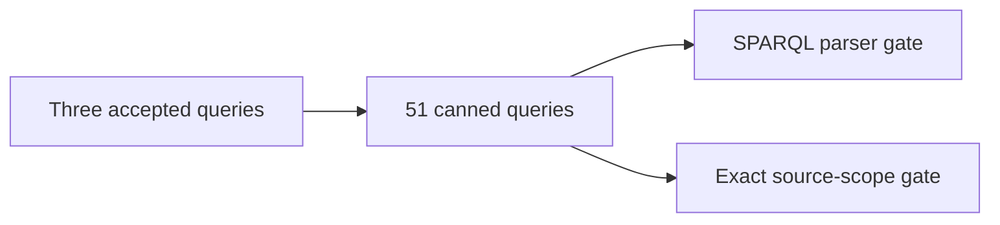

# Query catalog gate

```mermaid
flowchart LR
  Accepted[Three accepted queries] --> Inventory[51 canned queries]
  Inventory --> Parser[SPARQL parser gate]
  Inventory --> Scope[Exact source-scope gate]
```
