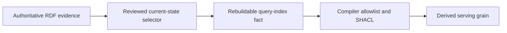

# Query-index contract shape

```mermaid
flowchart LR
  Authoritative[Authoritative RDF evidence] --> Selector[Reviewed current-state selector]
  Selector --> Index[Rebuildable query-index fact]
  Index --> Validator[Compiler allowlist and SHACL]
  Validator --> Serving[Derived serving grain]
```
