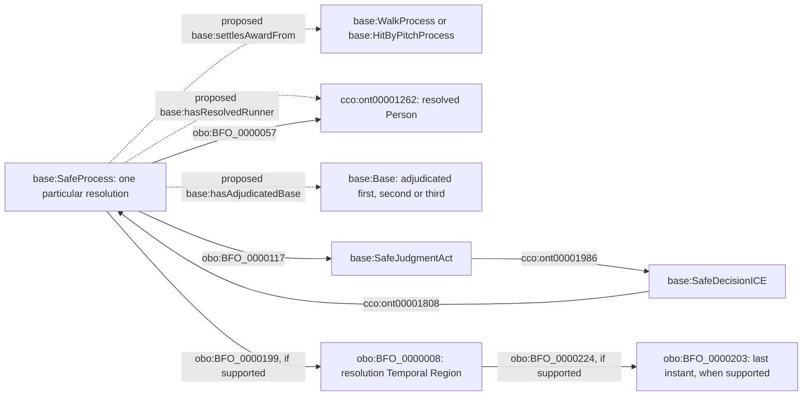

# Accepted resolution and award relations

The new properties below are defined in
[resolution-links.ttl](resolution-links.ttl); their evidence and interpretation
are specified in [resolution-links-review.md](resolution-links-review.md).
This section supersedes the missing award/destination edges in the original
diagrams above. It does not resolve their immediate-before or completeness gaps.

The award edge applies only to the supported walk/HBP cases. A Safe Process
following a hit can have the same adjudicated-base and resolved-runner links
without an award edge. A forced scoring arrival uses a distinct Run Process
with a resolved-runner and award link; `hasAdjudicatedBase` is not used as a
substitute for counted-run semantics. Each resolution preserves its existing
PA and Game context. The diagram does not assert an exact timestamp merely
because an enclosing source event has one.

There is no Person-to-Base arrow whose time is supplied only by a label.
The Safe Process is the existing event-scoped intermediary. Its adjudicated
base does not assert continued physical occupancy or continued entitlement
afterward. The original PA-start location stasis is separate.
