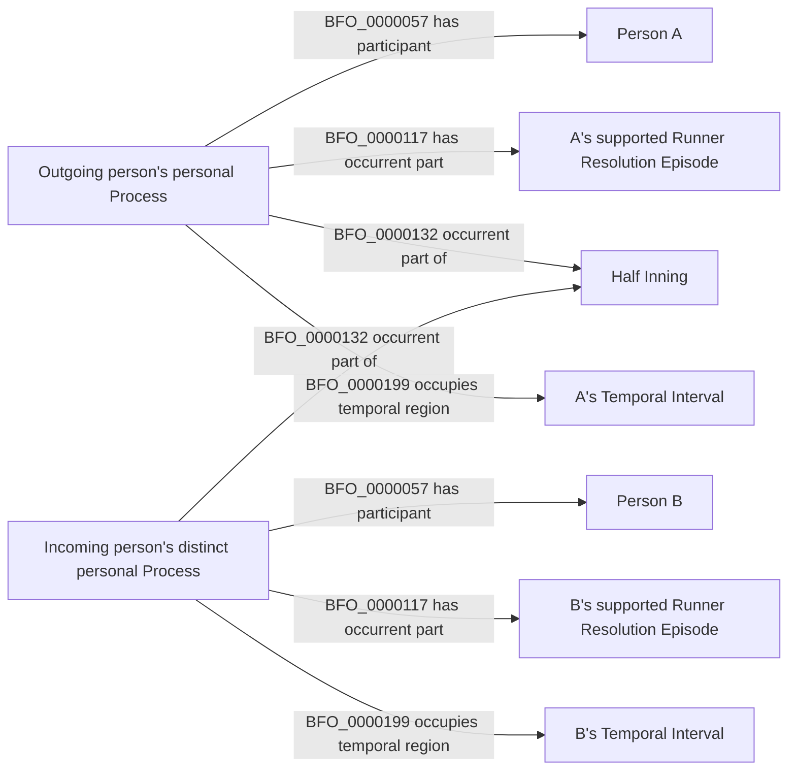

# Existing world-side pattern; proposed boundary identification

All nodes and relations use the accepted C1 vocabulary. No new replacement
relation connects the two Processes or Persons. Source evidence identifies
the end of one and beginning of the other. This picture does not assert
strict precedence between their full temporal extents. Placement uses the
same single-person pattern with independently supported later episodes.
