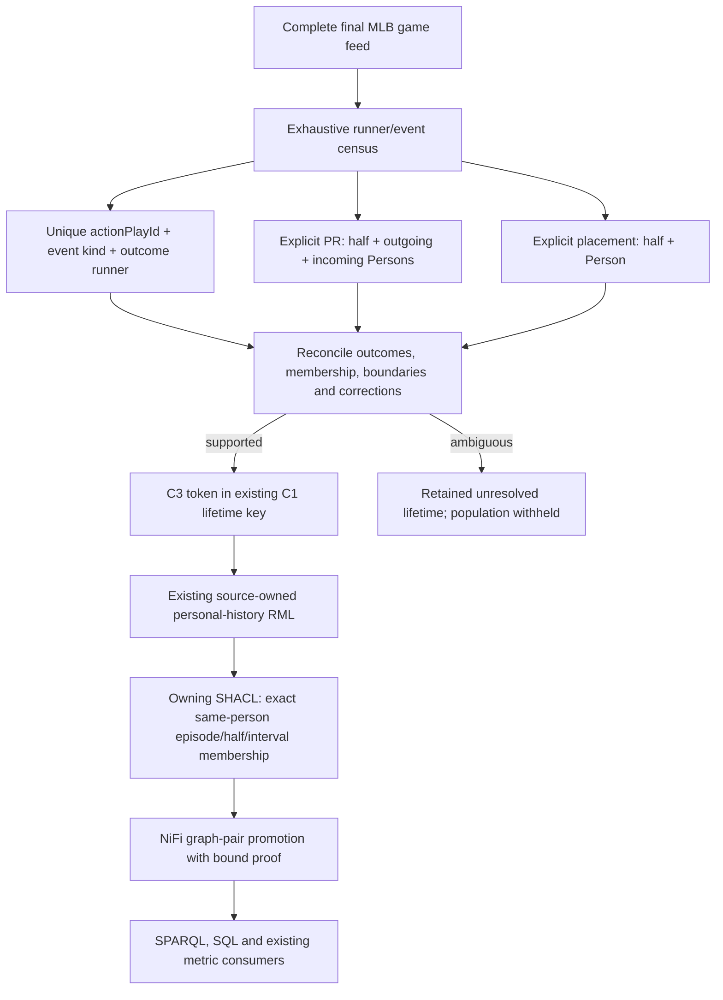

# Proposed owning-source projection

Arrows here show processing dependencies, not proposed RDF predicates. The
source module and accepted API -> RML -> SHACL -> Fuseki -> query -> SQL -> UI
lifecycle are unchanged. No executable C3 implementation exists before review.
