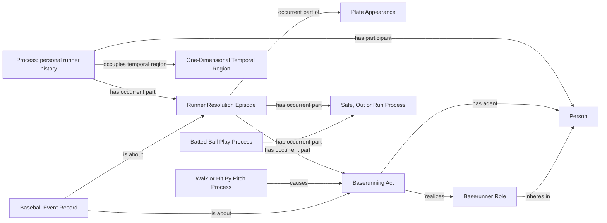

# Existing runner patterns; R1 review only

All classes, relations and identity policies are already accepted. The change
requested here is their targeted addition where selected existing games lack
the supported facts.

The personal history is an instance of BFO Process (`BFO_0000015`), with a
One-Dimensional Temporal Region (`BFO_0000038`). The contact containment uses
`BFO_0000117`; the award cause uses `cco:ont00001803`; the explicit agent uses
`cco:ont00001833`. Alternatives identify the existing types selected by current
mappings, not proposed common superclasses. Contact containment and award
causation apply only when their respective existing selectors support them.
No placement, history or clock is asserted merely because a diagram contains
the corresponding node. Endpoint designations and identifiers reuse the
existing Safe Decision and segment-origin maps listed in the scope inventory.
